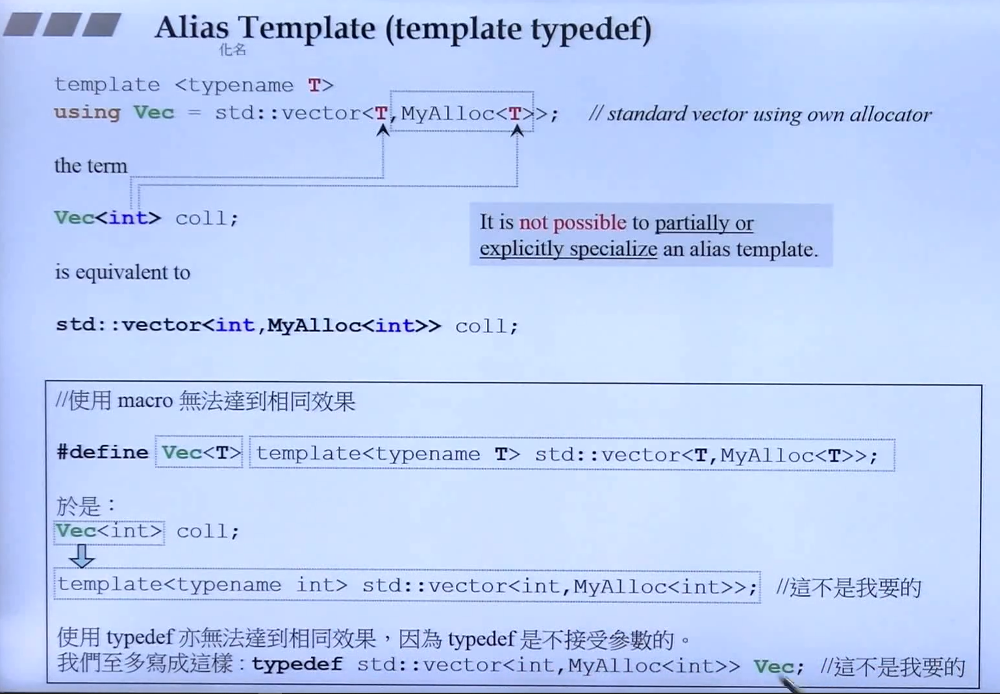
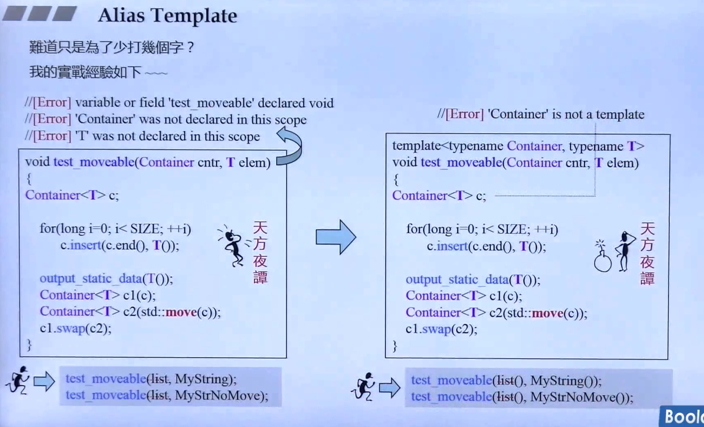
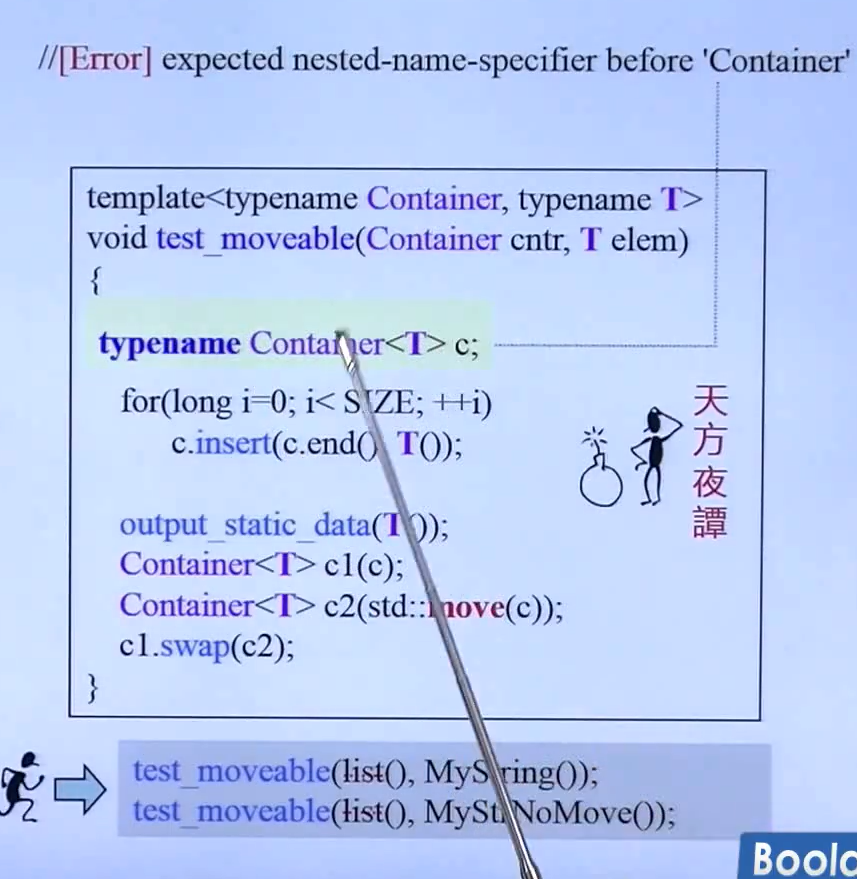
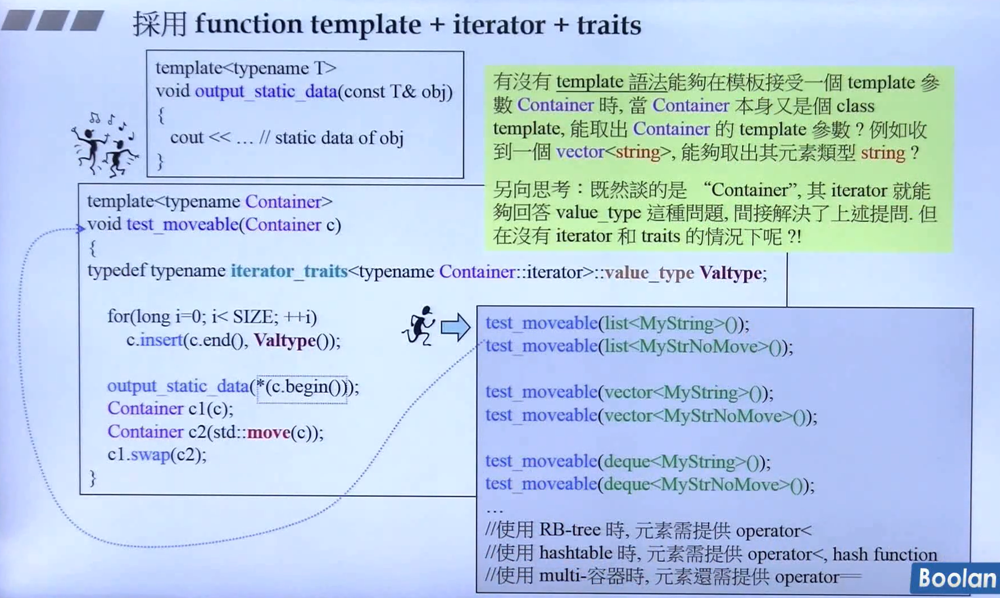
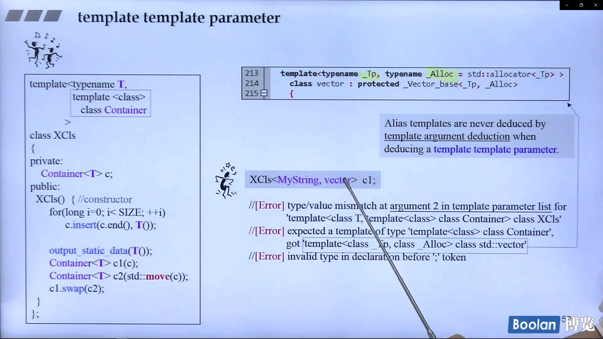
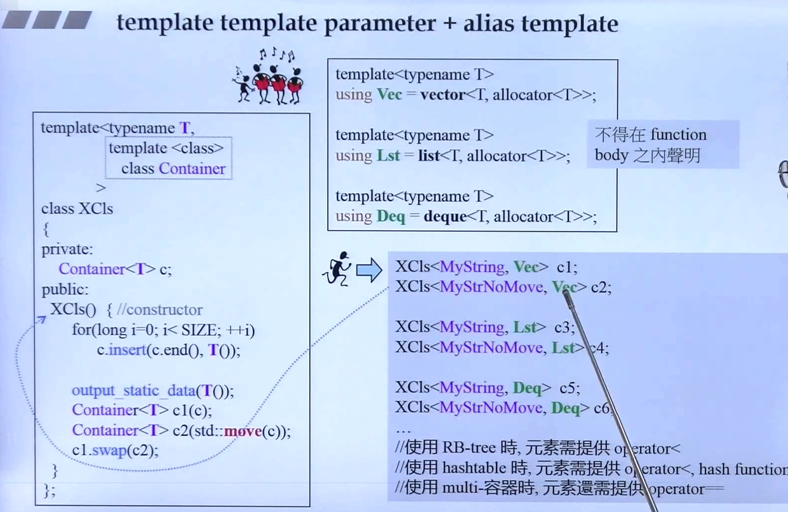

## 简介

Alias Template，别名（化名）模板。



如上图：

```C++
template<typename T>
using Vec = std::vector<T, MyAlloc<T>>;
```

使用 using 关键字，定义一个 **别名模板** Vec，用来表示 std::vector<T, MyAlloc<T>>，在使用时声明类型 **Vec<T>** 即可。

对于 **宏** 或者 **typedef**，都不能够达到 **别名模板** 的效果（<u>*下半框内部分*</u>）。

## 深度使用

侯捷老师给出了一个场景：



如上图，希望设计了一个函数，<u>***参数传入一个容器，另一个参数传入容器的元素***</u>，然后进行一些操作。

> ​	从 <u>*左半部分*</u> 看，这样的程序在 c++ 中简直是不太可能的。**毕竟参数是一个对象，而不能是一个类型**。况且使用的容器还有 insert 方法。
>
> ​	从 <u>*右半部分*</u> 看，即使将函数声明为模板函数，那同样也是不行的，不仅是**参数无法进行传递**（<u>*下面的 list()*</u>），而且**编译器也无法将 Container 类型视为一个模板**。



在原先的基础上，将 Container<T> 声明为一个 typename，即使这样编译器也无法正确编译，对于 typename 来说，后续的类型需要是：... **::** ... 的形式（双冒号）。（这个笔者也不太清楚 typename 的具体用法，先存个疑）。

那有没有一种 template 语法：<u>*能够在模板接受一个 template 参数 Container 时，当 Container 本身又是一个 template，能取出 Container 的 template 参数呢*</u>？



也是有的，对于 STL 的容器而言，其中比较重要的一部分是迭代器，通过萃取机 traits，可以取出迭代器所指向的元素的类型。参考 <u>STL和泛型编程.12. 迭代器的设计原则和iterator_traits的作用与设计</u>。

那么又有一个新的问题：

> 容器中的 iterator 可以通过 traits 来取出 value_type，那如果没有 iterator 和 traits 呢？

其实在 <u>C++面向对象高级开发.part2.6.模板</u> 有介绍一个概念：模板模板参数，可以解决上面的问题，那么下面则是用这个概念，结合 c++2.0 别名模板的特性，来解决这个问题。

## 模板模板参数



如上图，在 <u>*左半部分*</u>，将 Container 模板参数声明为一个模板类。

```c++
template<typename T,
	template<class>
        class Container
            >
```

这样就可以将 T 作为模板参数给模板类 Container。

但这样子编译器依旧回报错误：

> ​	调用端传入一个 vector，但却不是模板类 XCls 所期待的，**vector作为一个模板类，有两个参数（<u>*右上*</u>），第一个是元素类型，第二个是分配器**；**然而 XCls 的 Container 参数只接受一个参数**。
>
> ​	也许会觉得，vector 的第二个模板参数有默认值，但是作为模板模板参数传入时，编译器是不知道传入的模板类（vector）有第二个参数，还有默认值。

### 别名模板



如上图右上角，使用 alias template 的方式，声明一些别名模板，这些别名模板定义为一些容器的元素类型和分配器类型，那么在使用这些模板别名时，只需要传入一个模板参数即可。

> **注意：别名模板不能声明在函数体内。**