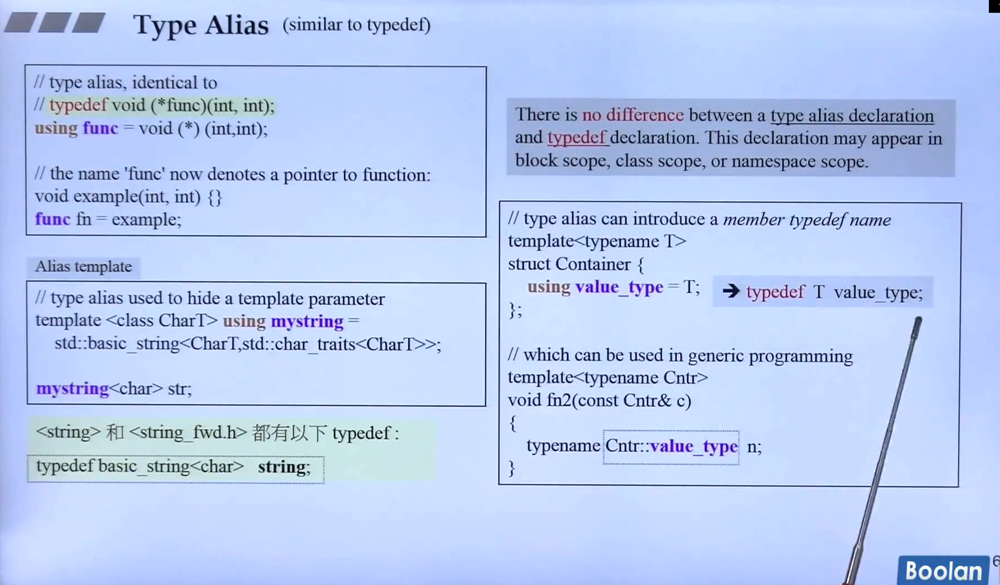
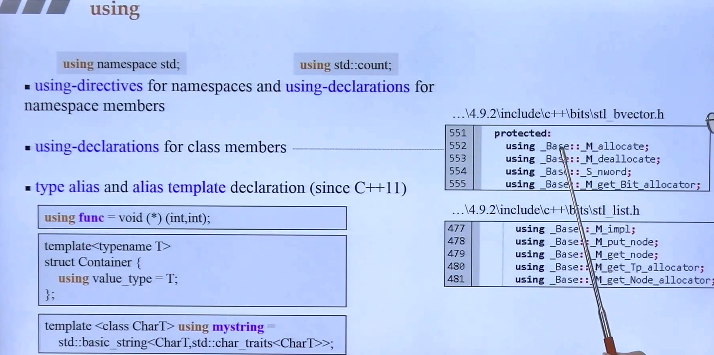
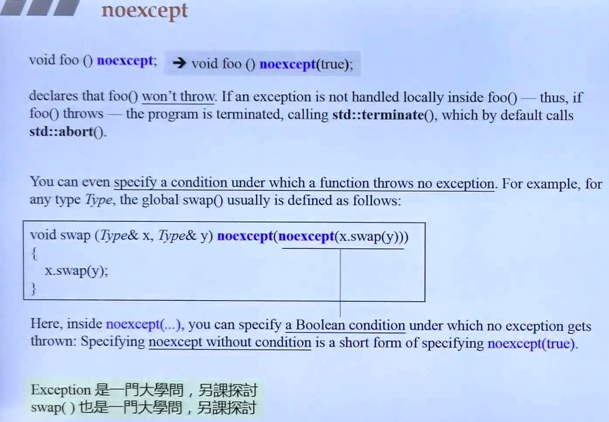
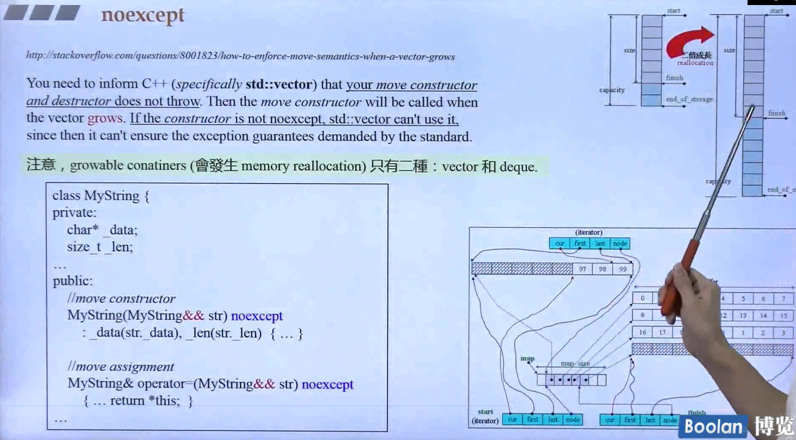

## 简介

在本节课重要介绍几个 类型别名（同样使用 using），以及新的关键字 **noexcept**、**override**、**final**

## Type Alias

类型别名，和别名模板其实差不多，但是别名模板在使用上有更加深层的方式。



如上图左上角，类似于 typedef：

```C++
typedef void (*func)(int, int);
using func = void(*)(int, int);
```

在**函数指针**的声明中，使用 typedef 其实在表达上没有这么明显，但是使用 using 就可以很清楚的看到 func 是一个函数指针，返回 void，传入 int, int。

在<u>*右半部分*</u>，在 Container 是声明了一个 value_type，是一个类型别名，**这种在模板中声明的别名，可以在另一个模板中作为 typename 声明使用。**不过在这里，使用 using 和 typedef 没有任何的区别。

## using



如上图，using 有 三个作用：

> 1.打开一个命名空间，或者说一个类，让不同的命名空间下可以使用对应的类（方法）。
>
> 2.在类成员中定义（使用）某个命名空间中的类。
>
> 3.类型别名、别名模板。（c++11新特性）

## noexcept



except 的意思是异常。关于异常，当一个函数出现异常时，会往上传递，若所有地方都没有进行异常处理，那么最后就会传递到 std::terminate（），最后触发 std::abort() 结束程序。

具体的使用如上图：**在函数的<u>声明最后</u>使用关键字 noexcept，表示该函数<u>一定不抛出异常</u>**。

然而这个关键字其实可以**传入条件参数**，表示在**符合某个条件时，不抛出异常**。

### 浅谈move

这里侯捷老师举了一个例子：vector 的两倍增长。

> 当 vector 在进行**两倍增长**时，会进行**拷贝**的操作；
> 若 vector 内的**类型实现了 移动构造 时**，则会去**调用 移动构造 而非 拷贝构造**。



那么如上图<u>*左下部分*</u>，在定义移动构造函数时，**必须声明为 noexcept，vector 才会被调用**，否则 vector 不敢去使用。

这里再复习一下：

> 对于容器的成长中，只有 vector 需要全量的去拷贝元素，而其他容器则不会。

<u>***所以这里详细介绍了 vector 在调用 移动构造时，需要声明为 noexcept***</u>，另外，即使不往 vector 中使用，那也需要声明为 noexcept，让使用者安心使用。

## override

这是一个很小的内容：

override 其实就是为了声明子类函数是继承自父类的函数，避免 函数名 / 参数 不小心写错。

使用 override 声明后，**若<u>子类</u>的函数不是父类的重写，那么编译器就会报错**。

## final

这也是一个很小的内容：

和 override 相反，一般用于父类方法。

**若<u>父类</u>方法声明为 final，则<u>子类不能够去重写</u>该方法，否则编译器会报错。**