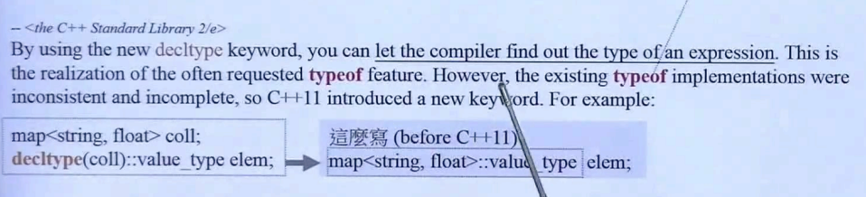
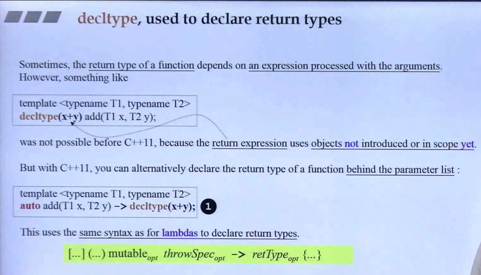
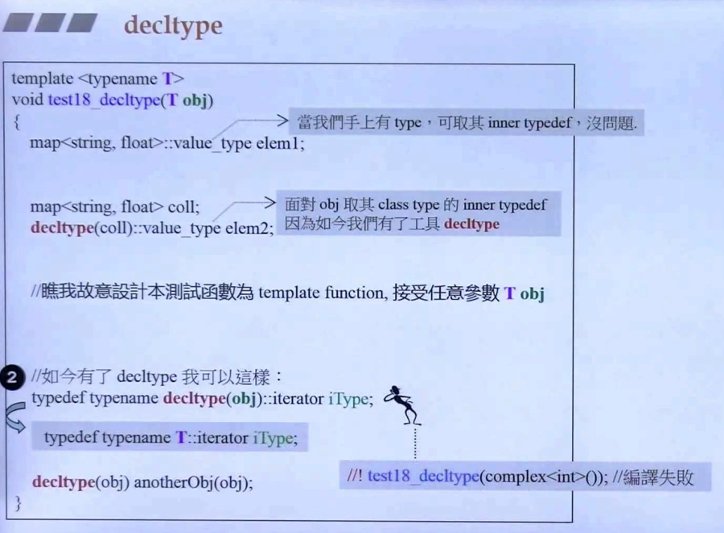
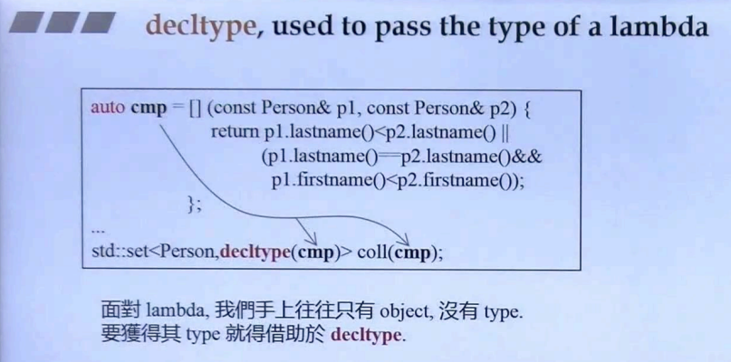

## 简介

decltype 可以说是 c++2.0 的新关键字。可以理解为 declare type，声明的类型。顾名思义，使用这个关键字，可以让**编译器找出某个 表达式 / 对象 对应声明的类型**。

如下图：



通过 decltype 获取 对象coll 的类型，然后获取类型中的内置类型 value_type。

## 应用场景

### 声明一个 return types



如上图，在一个 模板函数 add 中，拥有**两个模板参数（T1，T2）**，这和平常的理解（设计）有所不同，毕竟能够**相加的一般都是同类型，但这里是两个类型**。

由于这个设计（模板函数），导致相加**结果无法明确返回类型**，所以使用 decltype 关键字，让编译器去推导类型。如下段代码（<u>*截取自上图*</u>）：

```C++
template<typename T1, typename T2>
decltype(x + y) add(T1 x, T2 y);
```

但其实这样是编译不通过的。因为<u>***编译器在翻译到 decltype 时，x 和 y 还没有被声明***</u>，导致编译器不认识这两个变量。所以在 c++ 2.0 出现一个新的语法（<u>*截取自上图*</u>）：

```C++
template<typename T1, typename T2>
auto add(T1 x, T2 y) -> decltype(x + y);
```

如上面这段代码，使用 auto 作为返回值，然后使用 -> 符号，并指定为 decltype(x + y)。

### 适用于 metaprogramming

metaprogramming，元编程，指的是模板中的各种操作、运用。



如上图，面对泛型的对象 obj，可以通过 decltype 让编译器去推导其类型（<u>*截取自上图*</u>）：

```C++
typedef typename decltype(obj)::iterator iType;
```

### pass the type of  lambda

传递 lambda type。



如上图，对于 lambda 函数的返回类型，一般都是使用 auto 来进行声明。那么当我们需要 lambda 的返回类型时，可以通过 decltype 来得到对应类型。

```C++
std::set<Person, decltype(cmp)> coll(cmp);
```

