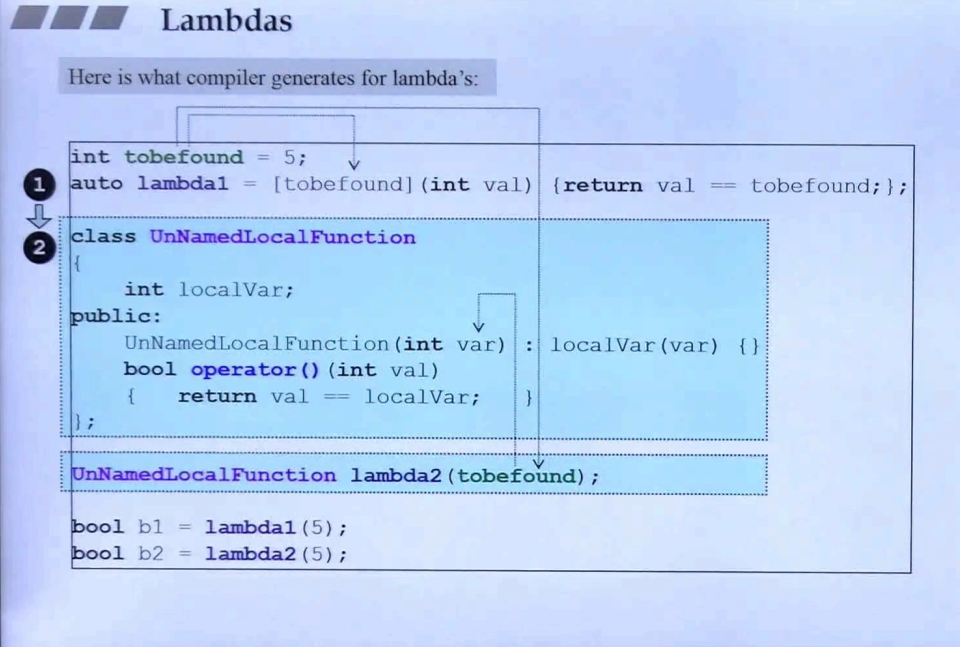

## 简介

c++2.0 引入了 lambda 关键字，它允许定义出一个 inline function（function object 函数对象）。它可以作为一个变量或者作为一个参数传入某个函数。

lambda 不必进行声明与定义，可以直接在某个语句或者在某个表达式中直接书写，然后再进行调用。


如上图，lambda 的写法：

```c++
auto I = [] {
  std::cout << "Hello lambda" << std::endl;  
};

//调用
I();
```

## lambda 结构


> [...]：导入器
>
> (...)：函数的参数
>
> 可选参数：
>
> ​	mutable：一个关键字，关系到 [...] 内的对象能否被改写
>
> ​	throwSpec：抛出异常
>
> ​	retType：返回类型， [decltype](12. decltype) 中有类似的用法
>
> {...}：函数体

### 导入器

即 [...] 中括号，可以**取用 lambda 外部的变量**。

如<u>*上图左下*</u>，使用 = 可以 pass by value（取值），对外部所有变量取值；使用 & 可以 pass by reference（取引用），对外部所有变量取引用。


如<u>*上图左半*</u>，lambda 函数 f 取用了外部变量 id，并且使用 mutable 关键字，标识 [...] 内部的变量可更改。

这种写法可以等同于 <u>*右半部分*</u> 的一个仿函数类，参考 <u>C++面向对象高级开发.part2.4.像函数的类</u>。

另外，可以看 <u>*左半部分*</u> 调用端，可以发现一个深惊奇的事情，将 id 赋值为 42，在 lambda 进行 ++ 操作，但是看运行结果：**id: 0, id:1, id:2**。可以看到这个值是第一次传入的 id=0 基础上进行操作的结果。其实也很好理解，<u>***将其等同于右边的仿函数类，就可以解释的通了***</u>。

**另外注意**：**若<u>*没有做 mutable 声明*</u>，是<u>*不能够对 id 进行++*</u> 操作**。


> **最左边：**
>
> ​	和上面的理解相同。可以更改 [...] 内部变量，但不能影响外部。
>
> **中间：**
>
> ​	[...] 内部对外部变量**取引用(&)**，那么不用写 mutable 也可以进行更改，并且可以直接影响到外部变量。
>
> **最右边：**
>
> ​	没有加 mutable，不能够对 [...] 内部成员进行改变，所以造成编译错误
>
> **左下角：**
>
> ​	这里只是介绍和一般函数相同，可以声明变量。

## 编译器翻译

上面简单提到了 lambda 可以等同于一个仿函数类，下面对这方面进行更加深入的解释。



如上图，编号 ① 可以等同于 编号 ② 的写法。

> [...] 内相当于仿函数的成员，并且在构造时传入
>
> 函数体相当于调用操作符。

## lambda type

在 [decltype](12. decltype) 章节中，介绍了可以使用 decltype 来传递 lambda type。在这里做详细介绍。


如上图，在 set 中传入 Person 类型，以及对应的比较大小的函数，<u>***这个函数是个 lambda，使用 decltype 可获取 lambda 的返回类型***</u>；另外，<u>***将 lambda 对象 cmp 作为 coll 的初值传入构造函数中***</u>。

lambda 的类型是个无名的函数对象（仿函数）。因此，需要声明一个 lambda 对象，需要使用 模板 或者 auto。**若需要知道 lambda 的类型，可以<u>*使用 decltype 关键字*</u>来获得**。<u>*这个场景适用于类似上图中，传递关联容器的仿函数类型模板参数*</u>。

再看上图，发现一个问题：

> <u>*在传入 lambda 的类型之后，为什么还要传入 lambda 的对象呢？*</u>

先来看看如果不传 lambda 对象会发生什么？会直接<u>***通过 lambda 的类型直接进行默认构造***</u>，但是，<u>***lambda 是没有默认构造函数的***</u>，也没有赋值操作；虽然说在上面说到可以等同于一个仿函数，但基于 lambda 的特殊语法，无法为其设计默认的构造函数。所以编译器会报出错误。

> <u>*所以，与其这样使用 lambda，不如直接编写一个仿函数*</u>

## 作为参数传入


如上图，可以看到，在调用 vector 的 erase 函数时，增加了一个删除条件 remove_if，在这个删除条件中传入了一个 lambda 对象，来代替仿函数类型。相比之下，lambda 更加简洁。

另外，lambda 是一个 inline function，效率上也会比较高。但其实比较微不足道，更加重要的在算法 algorithm 中。