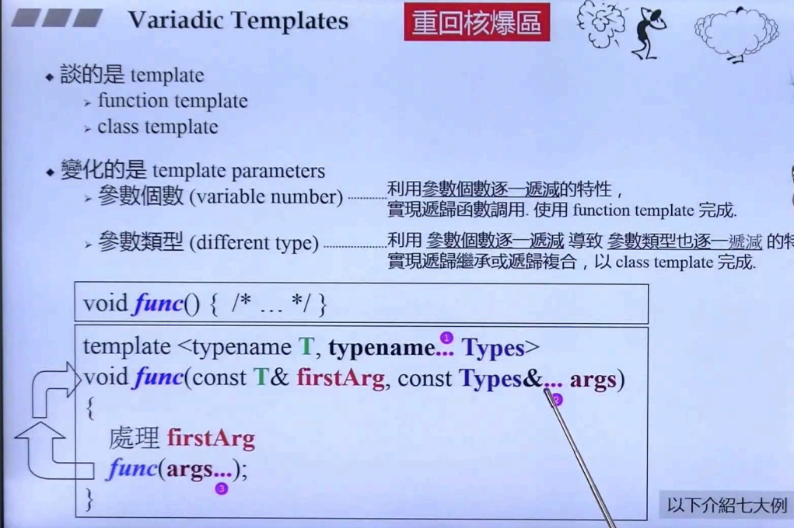
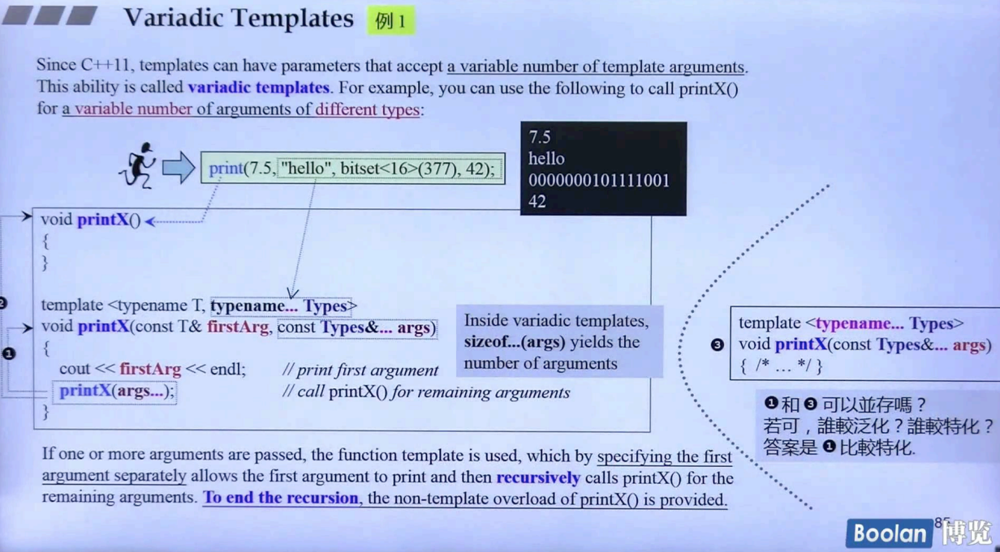
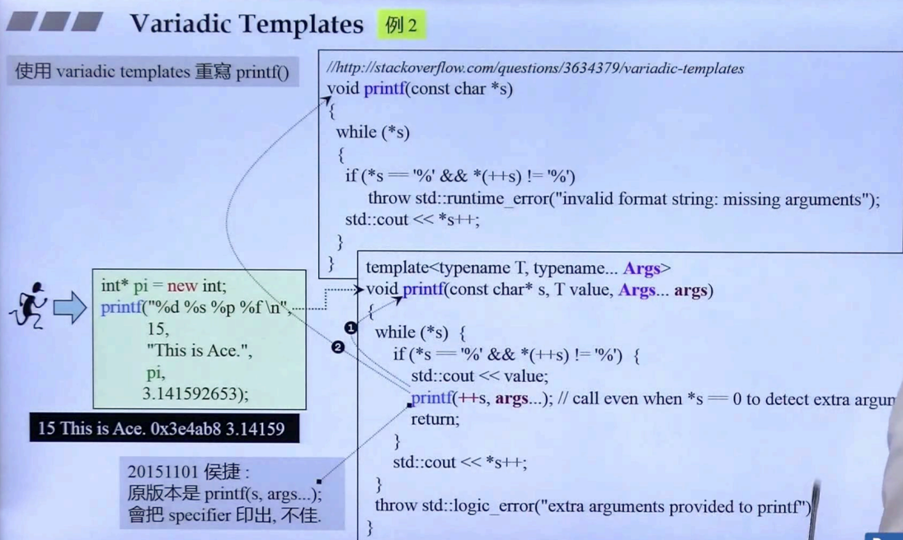
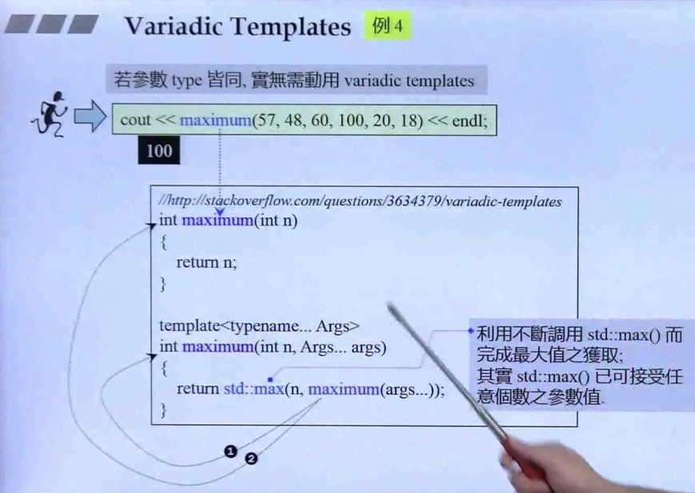
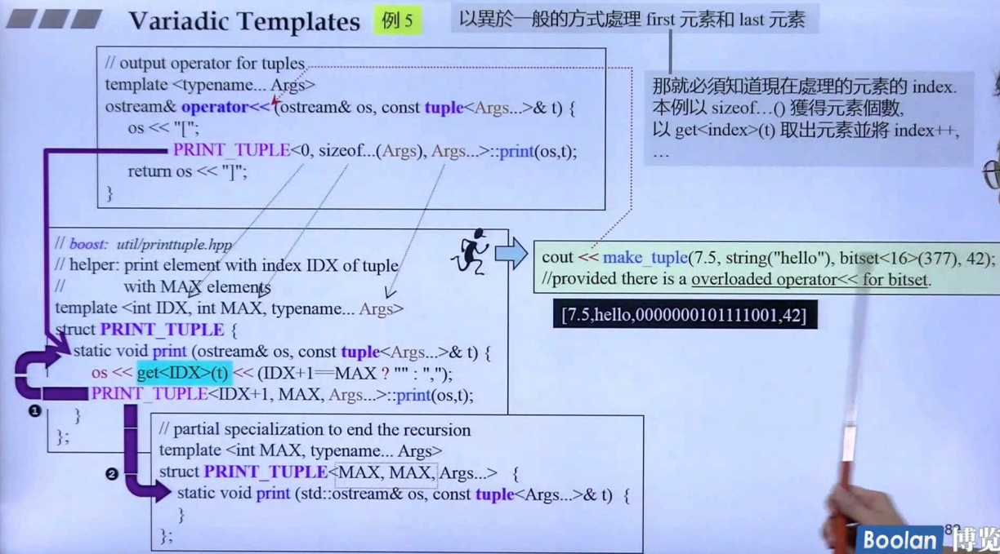

## 简介

在课程开头，简单认识了 [可变参数模板（Variadic Templates）](2. Variadic Templates)，让模板参数、模板类可以<u>***接收类型、数量不限的模板参数***</u>。

那么在这里，将重新深入这个模块，将以<u>***七个大的例子***</u>来展示这部分内容。

具体展示以下内容：



variadic templates，变化的是两个内容：参数个数、参数类型。

> **参数个数**：利用 **参数个数逐一递减** 的特性，实现递归函数调用。
>
> **参数类型**：利用 **参数个数逐一递减** 导致 <u>***参数类型也逐一递减***</u> 的特性，实现<u>*递归继承*</u>或者<u>*递归复合*</u>。

## print



如上述的例子，其实已经在第二讲里面看过：<u>*编写一个打印函数，可以接收多个参数*</u>。

```C++
void print() {   
}

template<typename T, typename... Types>
void print(const T& firstArg, const Types&... args) {
    cout << firstArg << endl;
    print(args...);
}
```

通过递归调用，将传入的参数分为 <u>*第一个*</u> 和 <u>*剩下部分*</u>。

注意（说了很多次了）：<u>当**参数包为 0 个时，不能再继续拆分**，因此需要定义一个空的 print 函数来调用。</u>

另外，若想知道参数包中有几个参数，可以调用 sizeof：

```C++
sizeof...(args);
```

### 特化部分

如上图，这里抛出了一个问题：

```C++
template<typename... Types>
void print(const Types&... args) {
    //...
}
```

> <u>*上面这个函数可以和原来的 print 函数并存吗？*</u>

按道理来说，应该是会发生歧义。<u>***但其实是可以并存的，而且原来的 print（一个参数 + 剩余参数）比较特化，在调用时永远会调用它。***</u>

## 重写 printf



如上图，在这个例子中，将去重写 printf 函数。

原来的 printf 函数如<u>*左半部分*</u>，接收一个 控制字符串（format），再加上多个参数，来输出对应形式的字符串。

对于 c++11 重写的部分（<u>*右半部分*</u>），对于 例子1 的 print 函数，只是简单的加上了一个控制字符串解析（遍历）部分的内容，然后使用 c++ 的 cout 函数，来做到打印内容。同样的，参数包部分内容也将分成 第一个 + 剩余部分 的形式，进行 printf 递归调用。

## maximum



如上图，定义一个<u>*输入多个参数，然后输出这些参数的最大值*</u>。

```C++
std::max(n, maximum(args...))
```

如上述代码段，利用标准库的 max 和 递归调用的方式，来获取多个参数的最大值。

## 不同的处理方式处理参数

### 头尾与其他不同

