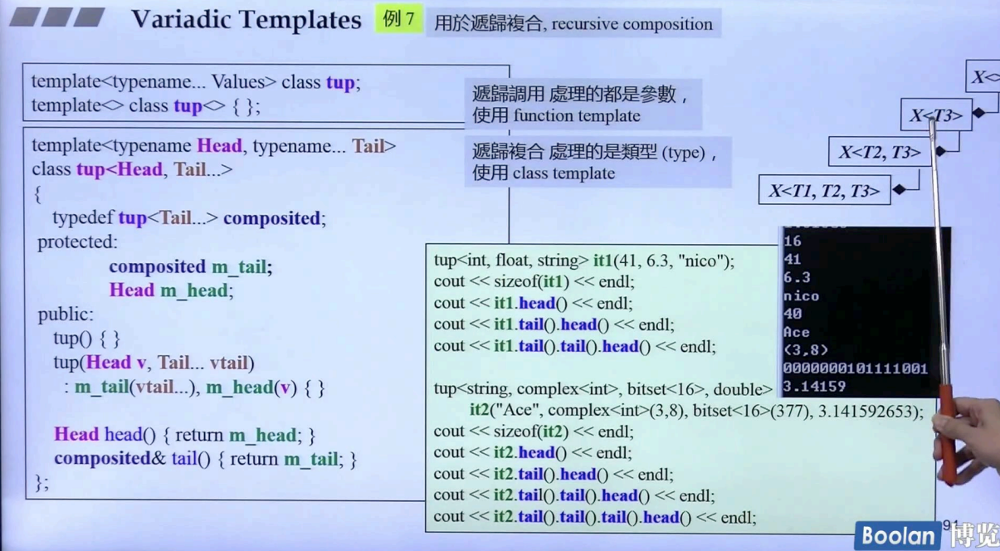

## 简介

在课程开头，简单认识了 [可变参数模板（Variadic Templates）](2. Variadic Templates)，让模板参数、模板类可以<u>***接收类型、数量不限的模板参数***</u>。

那么在这里，将重新深入这个模块，将以<u>***七个大的例子***</u>来展示这部分内容。

具体展示以下内容：


variadic templates，变化的是两个内容：参数个数、参数类型。

> **参数个数**：利用 **参数个数逐一递减** 的特性，实现递归函数调用。
>
> **参数类型**：利用 **参数个数逐一递减** 导致 <u>***参数类型也逐一递减***</u> 的特性，实现<u>*递归继承*</u>或者<u>*递归复合*</u>。

## print


如上述的例子，其实已经在第二讲里面看过：<u>*编写一个打印函数，可以接收多个参数*</u>。

```C++
void print() {   
}

template<typename T, typename... Types>
void print(const T& firstArg, const Types&... args) {
    cout << firstArg << endl;
    print(args...);
}
```

通过递归调用，将传入的参数分为 <u>*第一个*</u> 和 <u>*剩下部分*</u>。

注意（说了很多次了）：<u>当**参数包为 0 个时，不能再继续拆分**，因此需要定义一个空的 print 函数来调用。</u>

另外，若想知道参数包中有几个参数，可以调用 sizeof：

```C++
sizeof...(args);
```

### 特化部分

如上图，这里抛出了一个问题：

```C++
template<typename... Types>
void print(const Types&... args) {
    //...
}
```

> <u>*上面这个函数可以和原来的 print 函数并存吗？*</u>

按道理来说，应该是会发生歧义。<u>***但其实是可以并存的，而且原来的 print（一个参数 + 剩余参数）比较特化，在调用时永远会调用它。***</u>

## 重写 printf


如上图，在这个例子中，将去重写 printf 函数。

原来的 printf 函数如<u>*左半部分*</u>，接收一个 控制字符串（format），再加上多个参数，来输出对应形式的字符串。

对于 c++11 重写的部分（<u>*右半部分*</u>），对于 例子1 的 print 函数，只是简单的加上了一个控制字符串解析（遍历）部分的内容，然后使用 c++ 的 cout 函数，来做到打印内容。同样的，参数包部分内容也将分成 第一个 + 剩余部分 的形式，进行 printf 递归调用。

## maximum


如上图，定义一个<u>*输入多个参数，然后输出这些参数的最大值*</u>。

```C++
std::max(n, maximum(args...))
```

如上述代码段，利用标准库的 max 和 递归调用的方式，来获取多个参数的最大值。

## 不同的处理方式处理参数

### 头尾与其他不同


如上图，在 <u>*右边黄色打底*</u> 部分，需要按照 [,.. , ..] 的方式打印元素，其实就是**对元素的 头 / 尾 处理方式不同**。

> 实现的关键在于：**使用 <u>*sizeof...()*</u> 来获取参数包的大小**

现在从开头开始看：

> ​	1.看<u>*左上角*</u>，重载 operator<< 方法，用来打印 tuple 类型的的函数。这个函数会去调用 PRINT_TUPLE 方法。
>
> ​	2.看<u>*左边中间*</u>，PRINT_TUPLE 方法，接收 **IDX, MAX 和 ...Args** 三个模板参数，IDX 来获取当前打印元素的索引，通过 **get<IDX>** 方法获取 tuple 中的元素。每次取出元素时，会去和 MAX 做比较，来判断是否到最后一个元素。
>
> ​	3.看<u>*左下角*</u>，当 IDX == MAX 时，进入特化版本，什么都不打印。

## 递归继承


如上图，关于递归继承，在 c++2.0 标准库中有一个特别契合的例子：**tuple**。

现在从左边开始看：

> ​	1.tuple 的模板参数有两个，**Head** 和 **Tail...**，并且将 **Tail..** <u>***作为自身的模板参数进行继承***</u>。那么继承的结果<u>*如上图最右侧*</u>。
>
> ​	2.在<u>*中间的蓝色打底部分*</u>，通过 head 方法可以获取第一个元素，通过 tail 方法可以获取剩余元素。
>
> ​		**那么在内存的角度：子类对象是包含父类的成分（part），可以参考 <u>C++面向对象高级开发.Part1.11.组合与继承</u>。**（看<u>*中间最下面*</u>的内存结构图）
>
> ​	3.关于 **head** 函数，其实就是取出第一个元素，然后返回对应类型。
>
> ​	4.关于 **tail** 函数，<u>**传回自己（*this），然后进行类型转换（inherited）**</u>（如<u>*中间最下面*</u>的**灰色框**）。
>
> ​		*<u>由于继承的特性，父类成员的地址要比子类前，所以类型转换时，截取的是前半部分父类成员的地址。</u>*
>
> ​	5.关于 **构造函数**，将 **Head 作为自身成员**进行初始化，然后进行**调用父类构造函数进行父类成员初始化**。

其实这里还有一个小问题：关于 head 函数返回的类型是 Head::type，这其实是会导致编译出错的，直接将 Head::type 改为 Head 即可。

```C++
Head::type head() {return m_head;} //多次一举
Head head() {return m_head;}
```

## 递归复合



如上图，模板类 tup 中**有一个组合类型 composited**，并且**有个组合对象 m_tail**，用法和 tuple 完全一样。