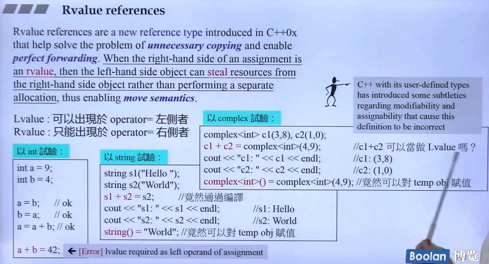
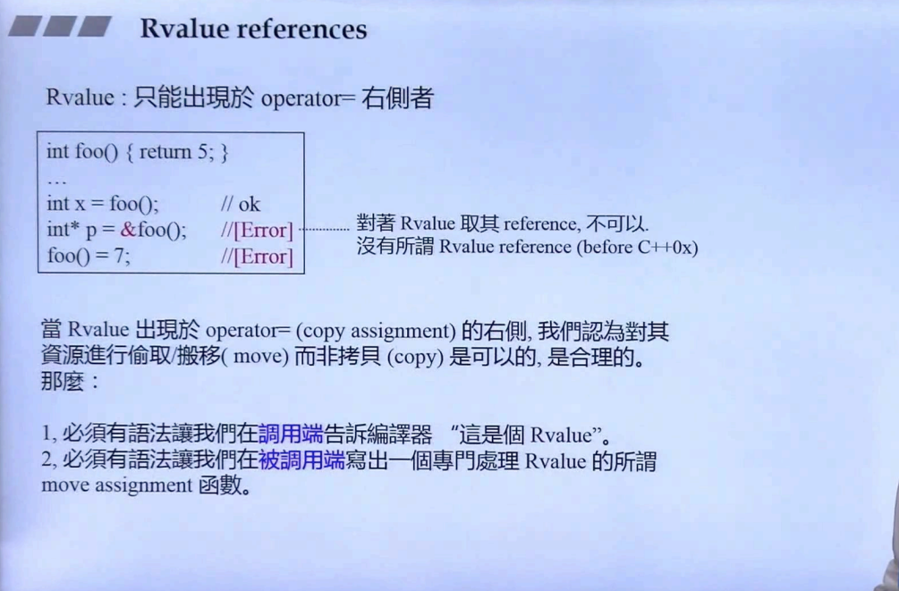
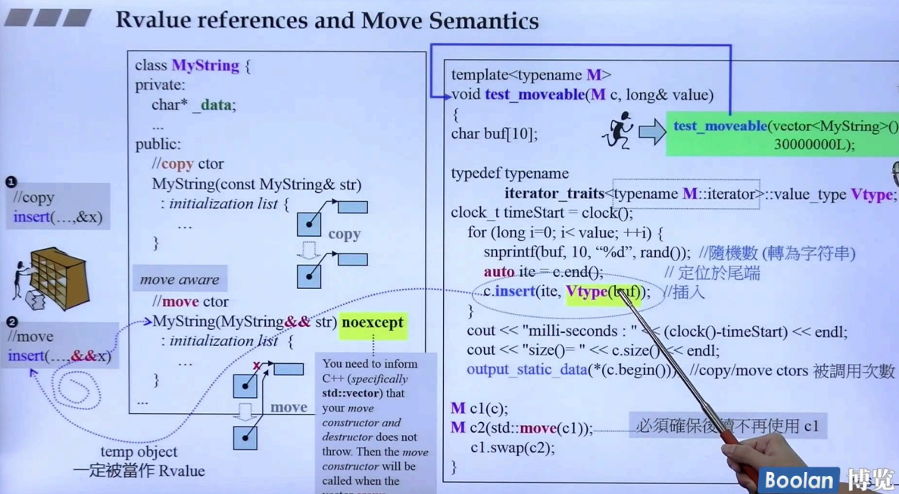
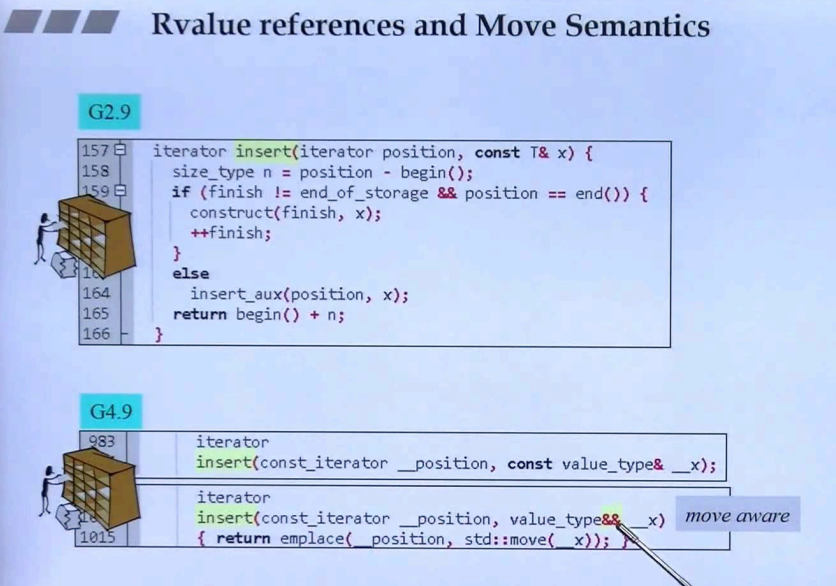

## 简介

在本节课程中，将会去介绍 <u>***右值引用***</u> 和 <u>***移动语义***</u>，这个移动的特性，能够号称<u>***大幅提高容器的效率***</u>。

## 右值引用



如上图：右值引用是一个新的引用类型，用来<u>解决**非必要拷贝**的问题</u>。

当赋值操作符（=）的**右边是一个右值（rvalue）**，那么<u>左边的对象可以去**窃取（steal）**右边的资源</u>，而<u>**不需要去重新分配内存**去存放</u>。

### 左右值

> 左值 lvalue：即变量，可以接收赋值操作。
>
> 右值 rvalue：不能放在赋值操作左侧。

如上图<u>*右下角（对 int 实验）*</u>，a、b为声明的 int 类型变量，是个左值，左值即为可以被赋值的值；而右值（如 a + b），不能够进行赋值操作。

```C++
int a = 9, b = 4;
a = b; b = a; //ok	对 a / b 进行赋值, 左值同样可以作为右值
a = a + b;	//ok	a + b 的结果是一个右值
a + b = 42;	//error	不能对右值进行赋值操作
```

另外，在<u>*上图中（对 string 实验）*</u>，在 **s1 + s2 = s2** 这行中，居然能够编译通过（对右值进行赋值）；除此之外，使用临时对象（纯右值）进行赋值，也是可以通过的！！

```C++
string s1("Hello");
string s2("World");

s1 + s2 = s2;	//能够编译通过
cocut << "s1: " << s1 << endl;	//s1: Hello
cocut << "s2: " << s2 << endl;	//s2: World

string() = "World";	//甚至可以对临时对象这种纯右值赋值！！！
```

> 使用 string 类，完全推翻了 int 类型的理解
>
> 另外，<u>*如上图右边*</u> complex 类型，也是和 string 同样的表现形式。这里不多赘述

> 这里也做了解释：<u>***c++ 在用户定义的类型中，对改变内容（赋值动作）有一些难以理解的内容（string、complex 类型的 右值赋值），这样会造成某些定义的不正确性。***</u>

但其实不必要太纠结，可能是标准库作者自己做了特殊的处理，没有遵循这个右值引用的特性。在这里只要记住：

> 1.临时对象是个纯右值。
>
> 2.右值不能放在赋值操作的左边。

### 右值引用



如上图，在代码段中：

```C++
int foo() { return 5; }
int* p = &foo();	//ERROR
```

这个地方会引起编译错误，对函数 foo 的返回值进行取地址，但是**函数的返回值其实是个临时对象，即是个纯右值**，那么就**不能对其进行引用（取地址）操作**。

> 而在 c++2.0 中，认为对**右值进行 移动/偷取（move） 而 非拷贝**是合理的。

为了使用这个 c++2.0 新添加的语义（移动），需要满足以下条件：

> 1.必须有语法让我们告诉编译器这是个右值（rvalue）。
>
> 2.必须写出专门处理这种右值的函数，即所谓的移动赋值函数。

因此，在 c++ 2.0 中出了个新的语法，名为**右值引用**，并将专门处理右值引用的函数称为**移动赋值函数**。



如上图，在 c++2.0 中，vector 的 insert 有一个新的版本：

```C++
//move
insert(..., &&x);
```

在右半部分，调用 vector 的 insert 函数时：

> 1.放入的元素是一个**临时对象，此时传入的是一个<u>右值</u>**，编译器会去**调用右值引用（<u>&&</u>）的函数**（即上面的版本）
>
> 2.vector 在 insert 时，会将后面的元素一步步往后挪，这个往后挪的过程在过去为拷贝（多次），既然会发生拷贝，那就会去**调用对应的构造函数**（拷贝构造、**移动构造**）
>
> 3.关于常见的拷贝构造函数，若类中有指针（动态分配内存），那么则会去分配一个新的内存，去存放被拷贝对象分配的内存内容；那关于 c++2.0 的**移动构造函数**，便会变为**指针的浅拷贝**，并且将<u>***被拷贝对象的指针失效***</u>，动作像极了 窃取。
>
> ​	<u>注意：移动的动作如果只是简单的指针拷贝，那么这个动作是非常危险的，所以移动构造函数***还会将被拷贝对象的指针失效！！***</u>
>
> ​	***<u>所以必须要有一个概念：若对象被移动，那么被移动之后不应该再去使用这个对象。</u>***

在回到上图，右边黄色打底部分，是一个临时对象，为一个纯右值，编译器则会去调用拥有右值引用版本的insert。

> <u>*那如果需要将左值进行移动呢？*</u>

标准库提供了一个函数：

```C++
std::move(obj)
```

<u>***这个函数可以传入左值对象，然后得到这个对象的右值引用。***</u>



现在来看看 vector 的 右值引用 版本的 insert 是怎么回事，如上图：

> 在 c++ 2.0 之前：需要通过不断地拷贝（往后移），来进行元素的插入
>
> 在 c++ 2.0 之后：添加了移动语义，不需要进行多余的拷贝

> 在这里大概率会感觉到很抽象，毕竟 MyString 和 vector 的右值引用版本的 insert 都没有做详细的介绍，不用着急，这里只需要理解基本的概念，后续会详细实现一个支持移动构造的类。