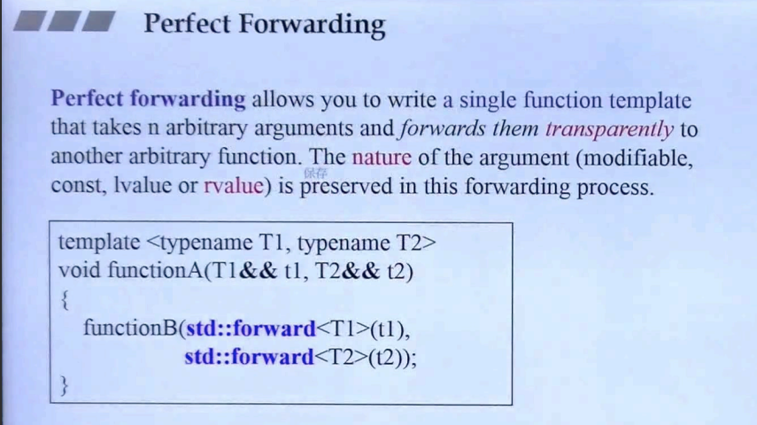
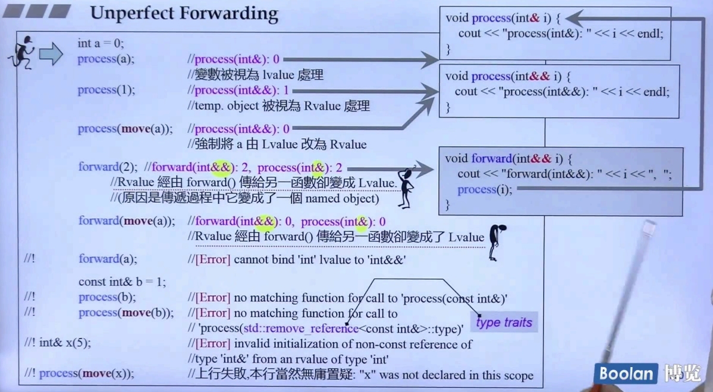

## 简介

在移动一个对象时，例如：通过 vector 的 insert 去移动一个临时对象，参考 [上一讲](15. Rvalue references and Move Semantics)。在 insert 后，会去调用元素对应类型的构造函数，这里有一个转接的过程。也可以参考<u>*下图*</u>：



在 functionA 调用 functionB 时，这是一个移动转接的过程，那么在转接的这个过程中，会遗漏掉一些信息。使用 `std::forward` 即可进行完美转发。

## 不完美转发



如上图：1.声明一个左值，在作为参数进行传递时：调用的方法的参数则是一个普通的引用。

```C++
int a = 0;
process(a);	//process(int& )
```

2.使用临时对象作为参数时：调用的方法的参数则是一个右值引用。

```C++
process(1);	//process(int&& )
```

3.使用 std::move 获取左值对象的右值引用时，和上面的是一致的，将会被视为右值。

```C++
process(std::move(a));	//process(int&& )
```

4.当进行转接操作时，一些信息遗失了

```C++
forward(2);	//forward(int&& )	->	process(int& )
forward(move(a));	//forward(int&& )	->	process(int& )
```

可以看到，调用函数 forward 时，调用的是右值引用的版本，这是非常正确的。**但是！**，**在调用 process 时，却是调用的左值引用的版本！**

也就是说，<u>***在经过一次转发之后，编译器将右值的属性丢失了，转而去调用左值的方法。***</u>这就是一个不完美的转发。

> 至于深层原因，这里侯捷老师没有讲😓。

## 引用折叠

> 这里顺便做一下补充：为什么会发生不完美转发？以及 `std::forward` 是如何解决的？

这里引用 [博客](https://zhuanlan.zhihu.com/p/398817111) 的内容，来介绍引用折叠的概念。

引用折叠是**模板编程**中的一个概念，是为了**解决模板推导后出现双重引用**（如下所示）的情况。 

```
- 左值-左值 T& &
- 左值-右值 T& &&
- 右值-左值 T&& &
- 右值-右值 T&& &&
```

 假设一个模板函数的定义如下：

```c++
template<typename T>
void PrintType(T&& param){ ... }
```

**当 T 为 int& 类型**，则`param`**被推导成 int& && 类型**，而 c++ 语法是不允许这种**双重引用**（在这里为 <u>**- 左值 - 右值**</u>）类型存在的（可以自己测试下定义一个双重引用变量，编译器将提示错误），所以便制定了引用折叠的规则，具体规则如下 ：

> 模板编程中参数类型推导**出现双重引用时**，双重引用将被**折叠成一个引用**，要么是左值引用，要么是右值引用。
>
> 折叠规则就是：<u>***如果任一引用为左值引用，则结果为左值引用***</u>。否则（即两个都是右值引用），结果为右值引用。 

所以在上述的 int& && 的 `param` 为左值引用。

这里提个关于模板类型推导的题外话：模板类型推导时，有时候并不像看到的那么直接，比如下面例子： 

```C++
int a = 0;          // 左值
PrintType(a);       // 传入左值
```

可能很多人的第一反应就是T被推导成int类型，其实不然，试想下如果T被推导成int类型，那么`param`形参就变成int &&类型，这显然无法通过编译，因为无法将一个左值赋给一个右值引用，所以<u>***这里编译器会将T推导成int &类型而不是int***</u>。 （这是有关模板参数型别推到部分内容）

### 不完美转发 && 完美转发

回到完美转发的议题上，如果上述`PrintType`定义成如下形式： 

```C++
template<typename T>
void PrintType(T&& param){ actualRun(param); }
```

那么其**仅仅起到一个参数转发的作用**，实际执行动作的是`actualRun`函数。这时候我们希望的动是`PrintType`能完全依照模板参数的类型将参数传递给`actualRun`函数，即<u>`param`是左值时，传递给`actualRun`的也是左值，`param`是右值时，传递给`actualRun`的也是右值</u>，这也就是 **完美转发** 的定义。 

这似乎是理所当然的事，但其实不然。

> 这里需要提到一个有意思的概念： *<u>**右值引用本身却是一个左值**</u>*。
>
> 这个其实就是造成不完美转发的本质原因。无论是 引用 / 右值引用，本质上都是一个引用类型的变量，那么这个变量就是一个左值。<u>*如下面的示例代码*</u>。

```C++
void Print(int& i) {
    cout << "Print(int& )" << i << endl;
}
void Print(int&& i) {
    cout << "Print(int&& )" << i << endl;
}

int&& ra = 1;
cout << ra << endl;
Print(ra);	//Print(int& )1, 调用的是左值版本
Print(std::forward<decltype(ra)>(ra));	//Print(int&& )1, 使用 std::forward, 完美转发最终调用右值版本
```

假设如果传入的参数是一个X类型的右值，则`param`被推导成X&& && 类型，<u>引用折叠后变成X &&类型（右值类型），而传递到`actualRun`却是一个左值类型，这时候调用将是`actualRun`的左值参数版本</u>（假设`actualRun`定义了多个重载版本），显然偏离了我们的本意。

解决方法也很好理解，使用 `std::forward` 方法即可解决：

```C++
template<typename T>
void PrintType(T&& param){ actualRun(std::forward(param); }
```

### std::forward

那么`std::forward`是如何做到完美转发的呢？先看下`std::forward`的大致定义： 

```c++
// 精简了标准库的代码，在细节上可能不完全正确，但是足以让我们了解转发函数 forward 的了
template<typename T>
T&& forward(T& param){
    return static_cast<T&&>(param);
}
```

**可以看到，不管T是值类型，还是左值引用，还是右值引用，<u>T& 经过引用折叠，都将是左值引用类型</u>。也就是forward <u>以左值引用的形式接收参数</u> `param`** 

1.传入 `PrintType` 实参是右值类型： 根据以上的分析，可以知道 T 将被**推导为值类型**，也就是不带有引用属性，假设为 int 。那么，将T = int 带入forward。

```C++
int&& forward(int& param){
    return static_cast<int&&>(param);
}
```

`param`在`forward`内**被强制类型转换**为 int&&，还是右值引用。最终保持了实参的右值属性，转发正确。 

2.传入 `PrintType` 实参是左值类型：

根据以上的分析，可以知道T将被推导为左值引用类型，假设为int&。那么，将T = int& 带入forward。

```C++
int& && forward(int& &param){
    return static_cast<int& &&>(param);
}
```

**引用折叠**一下就是 int &类型，转发正确。 