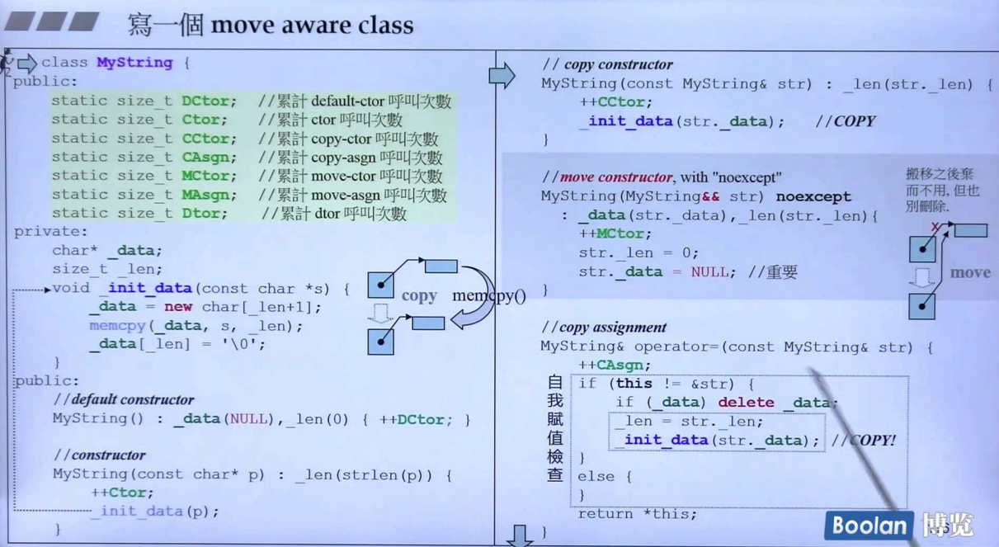
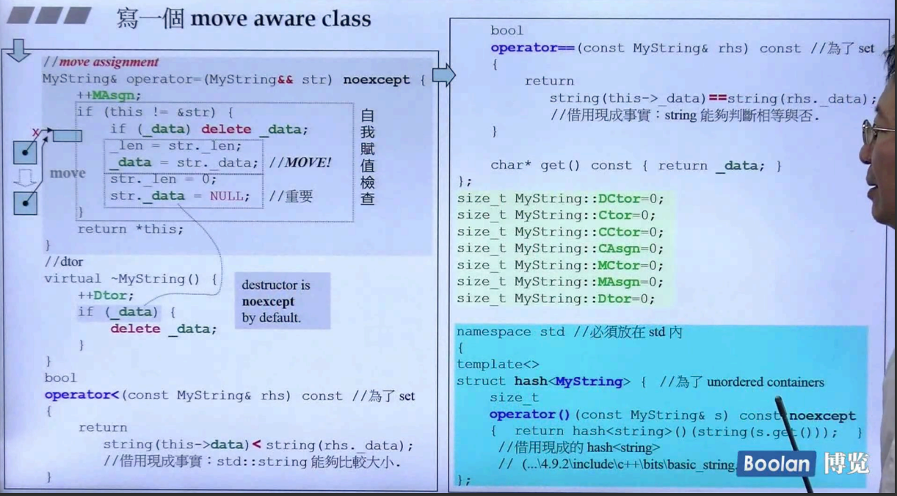

## 简介

在前面铺垫了 [右值引用和移动语义](15. Rvalue references and Move Semantics) 以及 [完美转发](16. Perfect Forwarding) 之后，终于要去写一个真正的可以被移动的类了。

如上图，对于 MyString 类，有对内存进行动态分配的操作，那么就必须定义 big three（拷贝构造、拷贝赋值、析构）。在这个类中，就是讲 `char* _data` 指向的内存进行拷贝操作，这里不多赘述。

那么在<u>*右手边*</u>的 **移动构造函数** 中（参数为右值引用的构造函数），只是简单的 **将指针进行拷贝** `_data(str._data)`，这是一个浅拷贝，没有重新进行内存分配。另外，将**被移动对象的指针设为 `NULL`**，即 `str._data = NULL`，这个操作是非常重要的。

同样的，移动赋值也是如此。

要注意的是：在析构函数中，需要去判断 `_data` 指针是否为 `NULL`，在不为 `NULL` 时，采取释放指向的内存，这也是非常重要的，否则会错误的释放内存，导致接收移动的对象出现错误。

