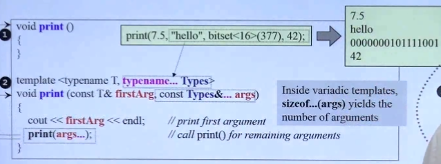
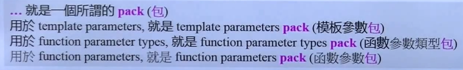
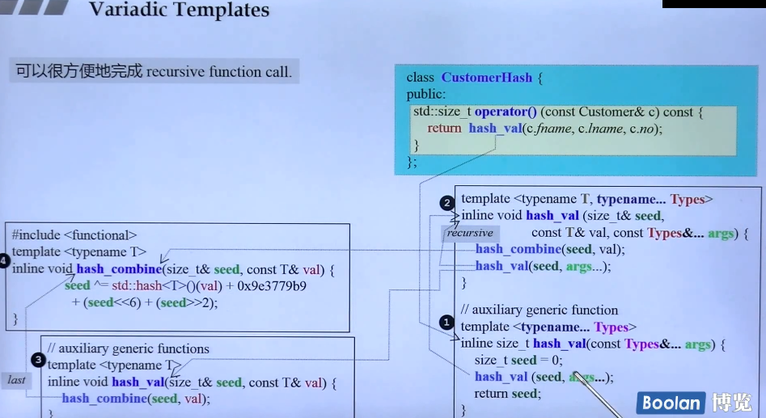
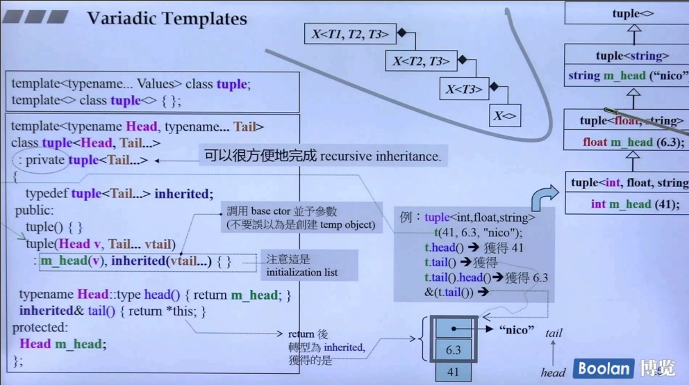

## 简介

本节课程介绍的是模板，准确的说是 **可变参数模板**，在 <u>侯捷C++面向对象高级开发-part2-6.模板</u> 中介绍过模板，并且在 <u>part2-7.c++11三个主题</u> 中简单提到可变参数模板，但是并没有去详细讲解。

### 模板函数

在这里举一个例子：

```C++
void print() {
}

template<typename T, typename... Types>
void print(const T& firstArg, const Types&... args) {
    cout << firstArg << endl;
    printX(args...);
}
```

在上述示例代码中，可以看到，print 是一个函数模板，它接收 <u>***一个参数***</u> 和 <u>***一包参数***</u>，这里的 args 为一包参数，并且这包参数中，<u>***数量随意，并且每一个参数的类型也随意***</u>。

可以看到语法的定义：

> **typename... Types**	在模板参数定义时，若需要定义为参数包，则需要在 typename 后面写 ..
>
> **Types&...** 在使用类型时，... 则需要写在定义的类型 Types 后面
>
> **args...** 在使用参数时，则和使用类型时相同，... 需要写在定义的参数 args 后面

虽然很奇怪，但是语法定义就是这样，需要习惯习惯。



如上图，可以看到 参数包 在 print 函数中的用法：**递归调用**

通过该用法，print 函数在每次执行时会去打印 第一个参数，然后将剩下的参数包继续传入函数。继续拆解成 **打印第一个参数、传递剩余参数** 的用法。

> **注意：**在上述递归调用的用法中，当调用到最后一个参数（42）时，**args 的数量为 0**，那么在进行递归调用时，**print 无法在将参数包 args 进行拆解**，所以需要写一个无参的 print，否则会出现编译错误。

递归的过程是将不定的参数进行一一分解，在上述例子中是将参数包拆分成 第一个 和 剩余部分。

另外，若想直到参数包中有多少个参数，可以使用以下语句

```C++
sizeof...(args)
```

来获取参数包中的参数数量。



可以使用上图的方法，来理解语法的含义。



关于可变参数模板函数，如上图，举了一个标准库中计算 **哈希值 (hash_val)** 的方法。

在右上角调用中，执行过程根据编号执行：

> 1.先执行 ①，这是一个参数为可变参数的模板函数，接收多个参数。
>
> 2.在 ① 中，调用该函数的 **特化版②**（seed, val, args...），该特化版本调用 hash_combine 来计算 seed，然后**递归调用 recursive**，来计算最终的 hash 值。
>
> ​	***<u>注意：对于为什么调用 特化版② 而不是 ①，原因归结于编译器会去优先调用更加符合的版本（size_t）。</u>***
>
> 3.当参数包中的参数剩下最后一个时，会去调用 **特化版③**（seed, val），来进行最后的 hash 值计算。

### 模板类



如上图，在标准库中，使用可变参数模板的模板类，一个很经典的例子：**tuple**

在这里用了一个很关键的用法：

```C++
: private tuple<Tail...>
```

这样的做法时可以很方便的进行**递归继承**。

然后在这个类中有一个 **Head 类型的成员** 和 **一个 tail 成员方法**，通过一些做法（<u>*中间灰色部分*</u>）来获取 tuple 中的元素。

同样也需要一个**无参特化版本** 的 tuple。

> tuple的定义：可以放任意个数、任意类型的元素放入其中，组合成一个 tuple。