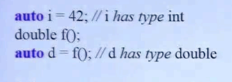
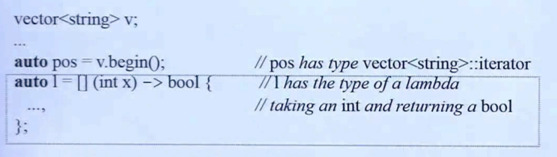

## Spaces in Template Expression

```c++
vector<list<int> >
vector<list<int>>
```

一个小改动，如上述代码，c++11以前的编译器中，若模板的参数是一个模板，则在最后需要加上一个**空格**，否则编译器认为是一个 >> 右移操作符。

而 c++11 以后则不会再出现这个问题。

## nullptr && std::nullptr_t

在 c++11 中，允许使用 nullptr 来代替 0 / NULL，来让指针赋值为空。 

```C++
void f(int);
void f(void*);

f(0);
f(NULL);
f(nullptr);
```

对于上述函数 f 的使用。

> **f(0);**： 调用 f(int)
>
> **f(NULL);**：若 NULL 定义为 0，则会去调用 f(int)；否则出现二义性。
>
> ​	当 NULL 定义为其它数时，**编译器可能会认为这是一个地址**，导致分不清调用哪种定义，出现二义性错误。
>
> **f(nullptr)**：调用 f(void*)

nullptr 是个新的关键字，std::nullptr_t 则是基于 nullptr 的类型进行定义

```C++
typedef decltype(nullptr) nullptr_t
```

## auto

在编译器编译过程中，编译器是可以通过实参推到，来推到出一些变量的类型，那么既然编译器拥有这个能力，c++11 推出一个新的关键字：**auto**，该关键字可以对类型进行推导。如下图。



> 在这里侯捷老师介绍到：
>
> ​	auto 最大的作用就是：**当类型太长不想进行书写**；或者说**类型比较复杂容易出错**时，则可以去使用。
>
> ​	**不建议一直用**。-



如上图，当类型是一个迭代器时，要编写的内容实在是太长；或者说是一个 lambda 表达式不知道是什么类型时，则可能会去使用 auto。

<u>***注意：使用 auto 关键字时，必须能够让编译器去推导出类型。***</u>

