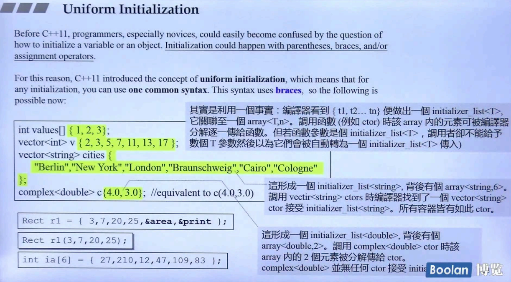

## 简介

unifrom initialization 即**一致性的初始化**。

如上图，在 c++11 之前，在初始化一个变量时，对于如何编写对应代码，会经常性发生混淆（特别是新手，老鸟就不谈了）。例如 **小括号**、**大括号** 或者 **赋值运算符**。

基于这个原因，c++2.0 引入了一个概念：**uniform initialization**，<u>可以统一使用 **大括号** 进行对象初始化，当然也可以兼容之前的版本</u>。

在这里侯捷老师深入解释了大括号的作用（<u>*在最上面的灰色打底*</u>）：

> 当编译器遇到 { } 时，便会做出一个 **initializer_list**（后续讲到）。
>
> 它会关联一个 **array<T, n>**，然后**调用对象的构造函数（或其他函数）**时，编译器会将 array 内的元素逐一传递该函数。
>
> 当调用的函数的**参数**是一个 **initializer_list** 时，<u>*则编译器**不会去逐一分解**，而是**将整个 initializer_list 进行传递**。*</u>

例如 vector，*<u>vector 的构造函数中，有一个版本是接收 **initializer_list**</u>*，则编译器会直接**将 { } 整体作为参数**传入到 vector 的该版本构造函数的参数中。

又如 complex（上图），该类的构造函数没有版本是接收 **initializer_list**，则编译器会**将 { } 内的元素逐一传入到构造函数的<u>*每个参数*</u>中**。

