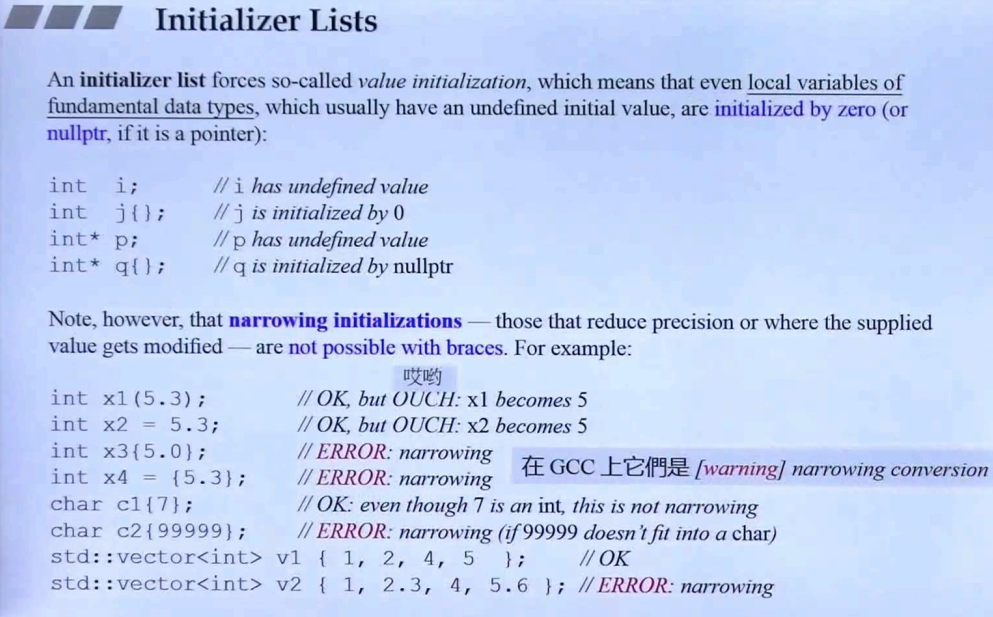
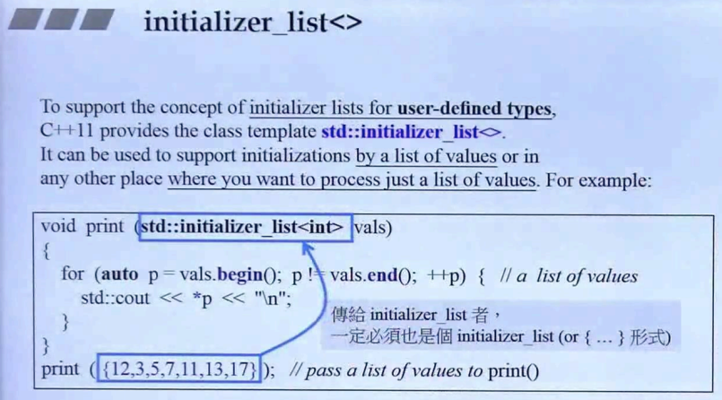
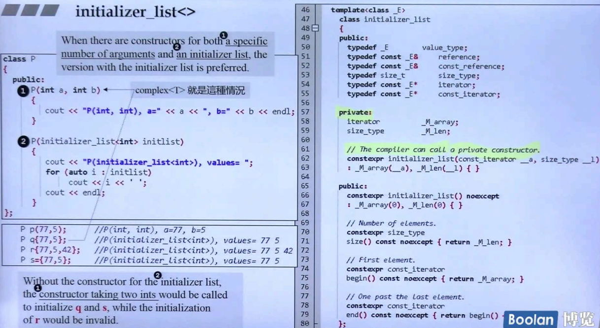
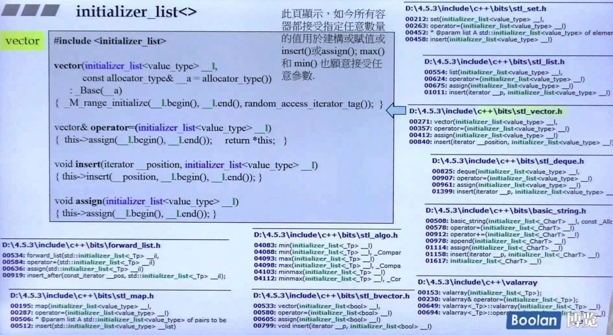
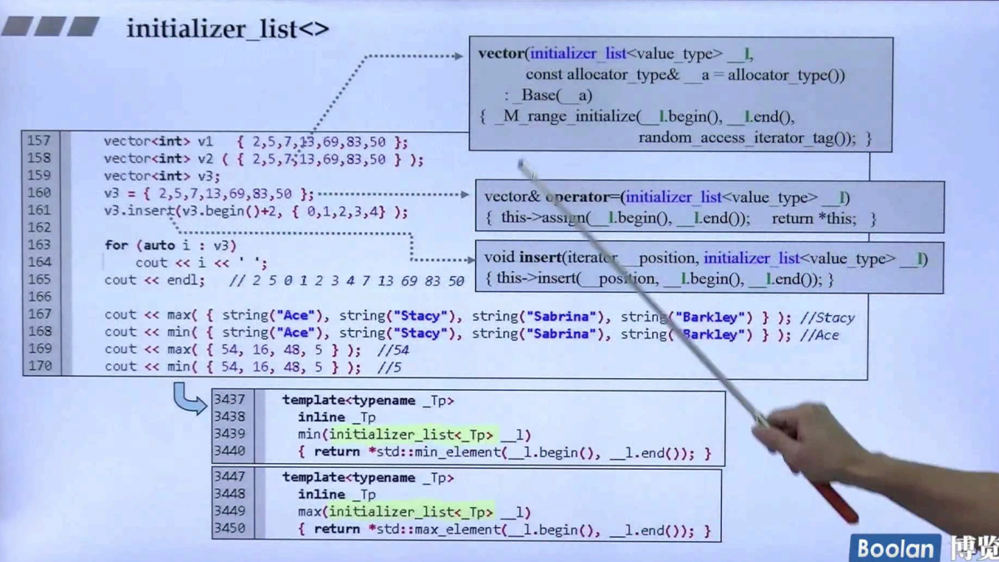

## 简介

Initializer_list 即**初始化列表**

在 [一致性初始化](4. Unifrom Initialization) 中简单提到：<u>*在对一个对象进行初始化时，若使用了 { }，编译器会将其识别为 initializer_list 初始化列表。*</u>

```C++
class UniformInitialization {
public:
	UniformInitialization(const std::string& str, int a){}
};

int main()
{
    //Uniform Initialization
	UniformInitialization uniformInitialization{ "abc", 123 };
}
```

初始化列表可以**传入任意数量、类型的参数**，<u>*如上述代码段*</u>，那么立刻就联想到 [可变参数模板](2. Variadic Templates)。



在这里再对上一节的内容（一致性初始化）做一些举例，如上图。

在<u>*上半部分*</u>：

> int 类型变量声明中，**{ } 可以进行<u>*初值设定*</u>**（对象为 0 / 指针为 nullptr）

在<u>*下半部分*</u>：

> 对于不能进行类型转换（或者说 **窄化转换**）的类型时，编译器会报错。
>
> <u>*但这是说的比较绝对，大多数平台都能对 窄化转换 的初始化列表进行类型转换，编译器当然也能够正常编译（warning）。*</u>

## initializer_list<>



从一致性初始化的方式，谈到了 { } 其实形成了一个 initializer_list，它背后的类型是标准库中的一个类：**initializer_list<>**，如上图。

可以看到，在上图的 point 函数中，接收了一个 **initializer_list<int>** 类型的参数，这个参数和标准库的容器使用方法大致相同，通过迭代器可对容器中的元素进行访问。

> 但有一点不一样的是，按道理来说，在一致性初始化时，{ } 中的参数应该类型和数量都不定，但是这里标准库中的 Initializer_list 却只是数量不同，<u>***那么说他是背后的类型是不是就存在了矛盾呢？***</u>
>
> 然而其实也并不会矛盾，在这里侯捷老师解释道：
>
> ​	在之前的一致性初始化时，{ } 使用的是一个 **可变参数模板**，是一个观念。而标准库中的 **initializer_list<>** 只是**一个容器**，编译器将**含有相同类型的 { }** 解释为 **initializer_list<>**。
>
> 这里就不打算继续纠结😖了，先往下看吧。

### 实现

先看看 **initializer_list<>** 的使用吧，如下图：



在<u>*左半部分*</u>，class P 在使用时做了四次初始化，分别用 **( )**、 **{ }**、**赋值运算符={ }**来判断应该调用哪个构造函数。

可以看到：

> ( )：调用含有两个参数构造函数。
>
> { }：调用参数为 initializer_list<> 的构造函数
>
> ={ }：调用参数为 initializer_list<> 的构造函数

另外在左下也做了解释：<u>***若 class P 没有参数为 initializer_list<> 的函数时，对象 q 和 s 也能够初始化，只不过调用的是第一个构造函数。***</u>

在<u>*右半部分*</u>，是 **initializer_list<>** 的实现有进行展示：

> 在成员变量中，有一个 M_array 和 M_len，这两个成员分别代表：array的迭代器（头），以及长度。
>
> 另外，关于**构造函数**，有一行比较重要的注释：编译器可以调用 private 的构造函数，该构造函数传入的是一个 **array 的迭代器** 以及 **长度**。<u>*在编译器调用时，编译器会构造好一个 array，并把对应的头和长度传入这个构造函数中。*</u>

关于 array，可以去参考另一个课程 **STL和泛型编程**。

> **注意**：initializer_list<> **并没有内含一个 array**，而是**内含一个迭代器（指针）**，那么，当拷贝这个类时，则是一个**浅拷贝**（拷贝成员，即 iterator 迭代器（指针））。

### 对标准库的影响



如上图，在 initializer_list<> 出现后，c++11对容器的实现基本上都对其做了适配（初始化列表），让对应参数都可以去接收一个 initializer_list<> 类型。

具体的使用如下图：

