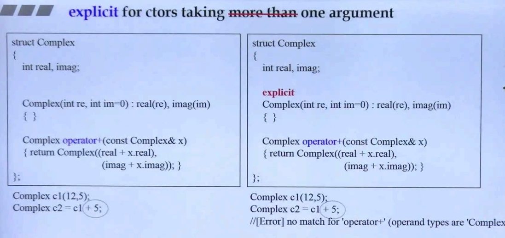
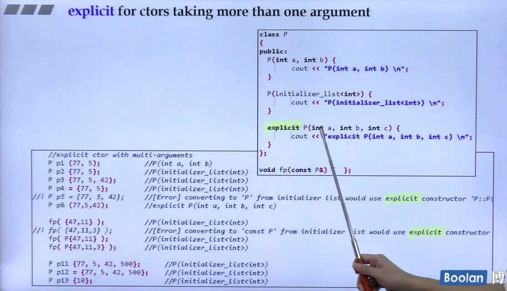

## 简介

### c++2.0以前

在 c++2.0 之前，**explicit** 关键字用于一个实参的构造函数，在 <u>c++面向对象高级开发.part2.2.转换函数</u> 中有简单提到，这里简单回顾以下，如下图：



在<u>*左半部分*</u>，对于 Complex 类，有一个构造函数，可以只接受一个实参（im = 0），**那么这个类可以进行类型转换，从 int 类型转换为 Complex 类型**。具体表现为

```C++
Complex c2 = c1 + 5;
```

在这里，编译器在对上述表达式进行翻译的时候：先找 operator+；然后再看 5 是否能够转换为 Complex，在这个步骤中，发现 Complex 有一个只接受一个 int 类型实参的构造函数，然后就进行 int 转换为 Complex。

若不想编译器这么智能，可以将 **一个实参的构造函数**声明为 **explicit**，那么编译器在翻译时就不会进行隐式转换（如<u>*右半部分*</u>），即告诉编译器要明确调用。

### c++2.0以后

以上就是 C++2.0 以前的 explicit 的用法，而在 C++2.0 以后，**explicit 可以对多个实参的构造函数进行修饰**。

## more than one argument



如上图，c++2.0以后可以对多个参数的构造函数进行 explicit 声明。

可以看到 **//!** 后的都是失败的代码，想要隐式调用 explicit 声明的多参数的构造函数。