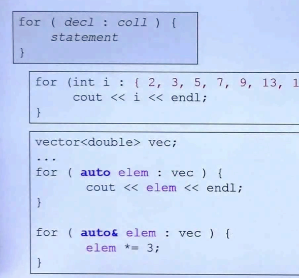
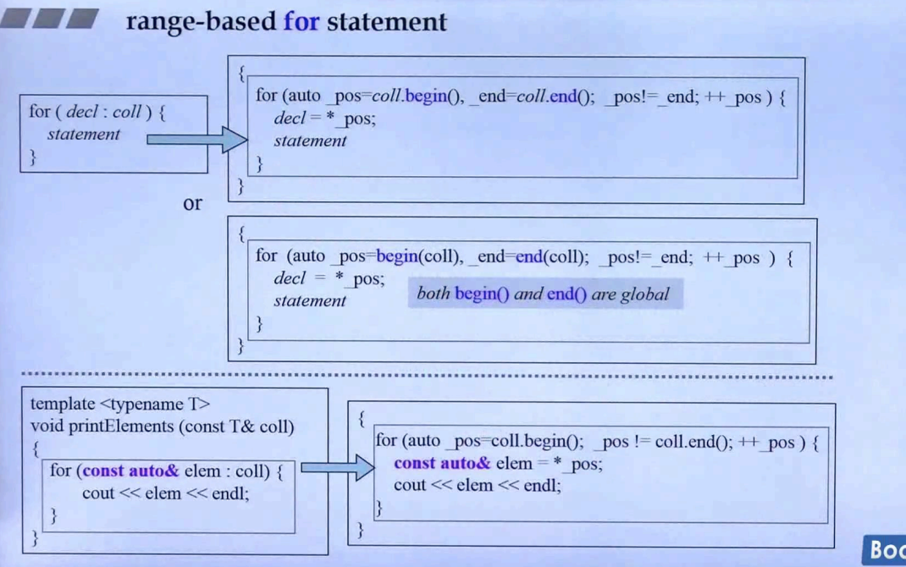

## 简介

这是一个侯捷老师觉得非常好用的一个特性😊



如上图，for 循环一般分为三段，然而在 c++2.0 后，出现了一种新写法，规则如<u>*灰色打底部分*</u>。这个循环被称为 **范围 for 循环**

这个语法是将 **: 后面**的元素一个一个赋值到 **: 前面**，然后进行循环体。

同样的，<u>*如下半部分*</u>对 vector 的循环操作，可以将变量设置为 **& 引用**。

## 编译器的解释



对于范围 for 循环，**编译器做的解释**可以解释为 <u>*上图部分*</u> 代码：

> 值传递（<u>*上半部分*</u>）：
>
> ​	将 **: 后面** 的容器的<u>***迭代器取出来***</u>，然后将<u>***迭代器指向的元素赋值***</u>给 **: 前面** 的变量
>
> ​	或者说通过**全局的 迭代器 函数**取出迭代器，然后进行上述操作。
>
> 引用传递（<u>*下半部分*</u>）：
>
> ​	和值传递大致相同，都是取出迭代器，然后从迭代器中获取元素。

## 实现一个支持 Range-based for 的类

这是一个补充内容，基于 [博客: C++11 写一个支持基于范围的for循环的类](https://blog.csdn.net/HandsomeHong/article/details/114860082) 做的一个实验。

> 1.**有 begin 和 end 方法**。由于在范围 for 循环时，编译器会去通过调用 begin 和 end 来获取开始和结束的迭代器，所以实现一个支持范围 for 循环的类必须有这两个方法。
>
> 2.迭代器必须支持 *****, **!=**, **++**。即迭代器必须实现 **解引用**、**不等于** 和 **自增** 操作符。
>
> ​	注意：这里的 ++ 指的是**前置 ++**，具体可以看 <u>STL和泛型编程.11.深度探索list</u>，这节课的笔记中有展示如何对迭代器进行 **前置/后置 ++** 的设计。

```C++
template<typename T>
class IterRangeBaseFor {
private:
	typedef IterRangeBaseFor<T> Self;

public:
	T* val;

public:
	// 解引用
	T& operator*() {
		return *val;
	}

	// != 判断
	bool operator!=(const IterRangeBaseFor<T>& other) const{
		return val != other.val;
	}

	//前置 ++, 没有参数
	Self& operator++() {
		val++;
		return *this;
	}

	//后置 ++
	Self operator++(int) {
		Self self = *this;
		++(*this);
		return self;
	}
};


class RangeBaseFor {
private:
	typedef IterRangeBaseFor<int> Iterator;

private:
	int val[10];
	Iterator IterBegin;
	Iterator IterEnd;

public:
	RangeBaseFor() {
		for (int i = 0; i < 10; i++)
			val[i] = i;

		IterBegin.val = val;
		IterEnd.val = val + 10;
	}

public:
	/*
	* Range-base for loop
	*/
	Iterator begin() {
		return IterBegin;
	}

	Iterator end() {
		return IterEnd;
	}
};

int main()
{
	RangeBaseFor rangeBaseFor;

	for (int i : rangeBaseFor) {
		std::cout << i << " ";
	}
}

/*
* result:
* 0 1 2 3 4 5 6 7 8 9
*/
```

如上述代码展示，class RangeBaseFor 是一个支持范围 for 循环的类。

