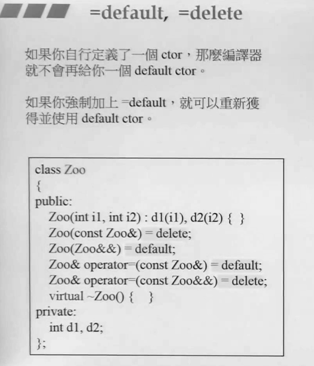
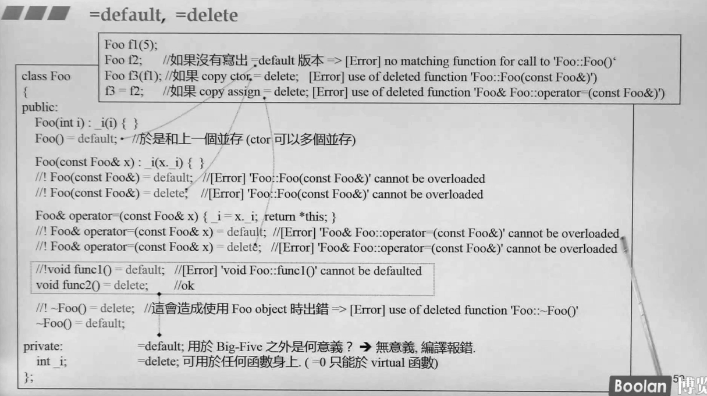

## 简介

关于 **=default**，很容易就会去联想到 "默认"，对于默认在 c++ 就会去联想到编译器提供的一些默认的函数，参考 <u>C++面向对象高级开发.part1.14.关于编译器的一些补充</u>。**缺省构造函数**，**拷贝构造函数**，**拷贝赋值函数**，以及**析构函数** 这四类被称为特殊的成员函数，若用户没有显式定义，那么编译器就回去隐式声明他们。

另外，**=delete** 的作用范围也是如此，同样是作用域上述的四种函数，让类失去一些特定的行为（例如拷贝、拷贝赋值等...）

如上图，在 c++2.0 中，出了个新的语法，叫做 **右值引用**（后续），这个类型的参数可以在类中构成 **移动构造**、**移动赋值** 函数。

### big five

一般来说，=default 和 =delete 一般作用于五种函数：**缺省构造函数**，**拷贝构造函数**，**拷贝赋值函数**，**移动构造** 和 **移动赋值**。

其实是 六种，还有 **析构函数**，但是很少用到。

## 使用场景

如上图：

> **构造函数**：
>
> ​		