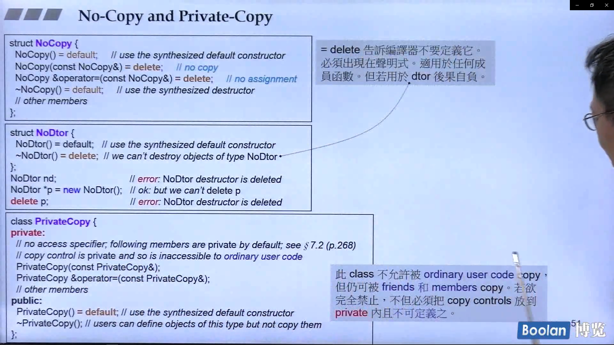

## 简介

关于 **=default**，很容易就会去联想到 "默认"，对于默认在 c++ 就会去联想到编译器提供的一些默认的函数，参考 <u>C++面向对象高级开发.part1.14.关于编译器的一些补充</u>。**缺省构造函数**，**拷贝构造函数**，**拷贝赋值函数**，以及**析构函数** 这四类被称为特殊的成员函数，若用户没有显式定义，那么编译器就回去隐式声明他们。

另外，**=delete** 的作用范围也是如此，同样是作用域上述的四种函数，让类失去一些特定的行为（例如拷贝、拷贝赋值等...）


如上图，在 c++2.0 中，出了个新的语法，叫做 **右值引用**（后续），这个类型的参数可以在类中构成 **移动构造**、**移动赋值** 函数。

### big five

一般来说，=default 和 =delete 一般作用于五种函数：**缺省构造函数**，**拷贝构造函数**，**拷贝赋值函数**，**移动构造** 和 **移动赋值**。

其实是 六种，还有 **析构函数**，但是很少用到。

## 使用场景

> 下面介绍一下各种情况，来展示 =default 和 =delete 在各种情况下什么时候可以加，加了或者不加编译时通不通过。


如上图：

### **构造函数**：

> ​	可以看到，Foo 类有一个有参构造函数，将 **缺省的构造函数** 声明为 =default，这是当然可以的，毕竟构造函数可以重载很多份。

### **拷贝构造函数** 和 **拷贝赋值函数**：

> ​	当已经进行定义时，不能再将其声明为 =default 或者 =delete。
>
> ​	其实感觉 无参构造函数 也是如此。

### **一般函数**：

> ​	对于一般函数，根本就**没有什么默认（default）版本**，然而 **=delete 是没问题的**。
>
> ​	然而对于一般函数 =delete 而言，其实不写就行了，没必要声明 =delete。
>
> ​	另外，=delete 和 =0 对比来说，**=0 用于虚函数，表示为纯虚**；而 **=delete 可用于除了 big five 以外的任何函数**。

### **析构函数**：

> ​	对于析构函数而言，两个版本均可，只不过在**析构函数为 =delete 时，在析构时会出错**。

<u>***其实关于什么函数能够 =default 或者 =delete，在于编译器能否理解并且给出相关定义。***</u>

## Big Three(Five)

这里介绍什么情况下需要自己来定义 Big Three（构造、拷贝构造、拷贝赋值、析构、移动）呢？

其实在 <u>C++面向对象高级开发.part1.7.类的三大函数(拷贝、析构、拷贝赋值)</u> 中其实介绍到，当类成员中**包含了指针类型成员**（即在类中有**进行动态分配内存**）时，则需要定义 Big Three。

> 可以参考上述引用的文章，里面有进行详细介绍。（深浅拷贝）

## No-Copy 和 Private-Copy

基于 Big Three 的讨论，下面将介绍以下三个 class ，分别为 NoCopy、NoDtor 和 PrivateCopy



### NoCopy

当想要定义一个不允许拷贝的类时，需要将拷贝相关的函数进行删除，实际上就是将 **拷贝构造、拷贝赋值 声明为 =delete**

### NoDtor

不允许析构一个对象，但一般不会使用。

### PrivateCopy

这个类型实际上是对 NoCopy 类型进行一个变化，NoCopy 表示为不允许任何拷贝。

而 PrivateCopy 将 **拷贝构造、拷贝赋值 声明为 <u>private</u> 中**，那么，只有在**这个类的 <u>成员函数 / 友元</u> 中才能够进行 <u>调用拷贝相关函数</u>**。

如下代码段所示：

```C++
class PrivateCopy {
	friend void Copy(const PrivateCopy&, PrivateCopy&);
private:
	PrivateCopy(const PrivateCopy& other) = default;
	PrivateCopy& operator=(const PrivateCopy& other) = default;

public:
	PrivateCopy() = default;

public:
	//成员中调用私有拷贝函数
	void Copy(const PrivateCopy& other) {
		*this = other;
	}
};

//友元中调用拷贝函数
void Copy(const PrivateCopy& src, PrivateCopy& dest) {
	dest = src;
}

//'PrivateCopy::operator =': cannot access private member declared in class 'PrivateCopy'
void Copy1(const PrivateCopy& src, PrivateCopy& dest) {
	dest = src;
}
```

