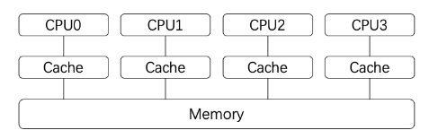
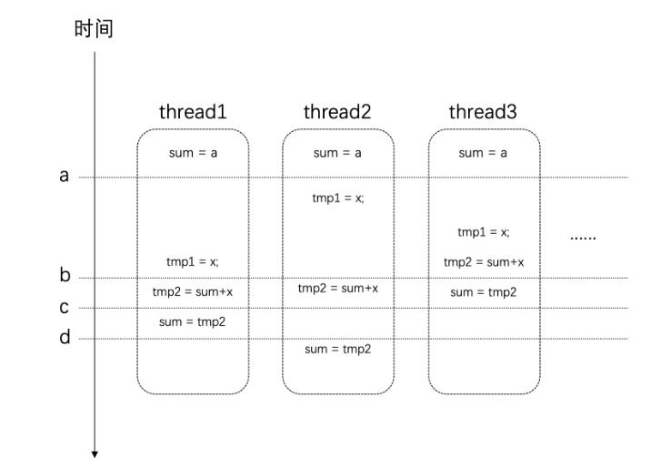

## 简介

在这里将整理并且介绍 c++2.0 以后，包括 c++11 和 c++17 的并发编程部分的内容，这些内容包括：`std::thread`， `std::future`，`std::promise`，`std::mutex`， `std::condition_variable` 等等。

本文的内容将大量引用 [博客 C++ 并发编程（从C++11到C++17）](https://paul.pub/cpp-concurrency/)

## 创建线程

使用 c++ 11 标准库 `std::thread` 来创建一个单独的工作线程。

```C++
#include <thread>
#include <iostream>

using namespace std;

void hello(int& num) {
    //输出 thread_id
    cout << this_thread::get_id() << ": " << "Hello World from new thread." << ", num: " << num << endl;
}

int main() {
    int num = 1;
    //引用传递, 使用 std::ref
    thread t(&hello, std::ref(num));
    t.join();
    return 0;
}

```

一个简单的线程就这样被创建了出来，这里**需要注意**的是：

> 线程 thread 绑定的函数，在这里**默认是以值传递**的。若绑定的函数<u>有引用传递的参数，需要使用 `std::ref` 才能够取得参数的引用。</u>

### join && detach

| API    | 说明               |
| :----- | :----------------- |
| join   | 等待线程完成其执行 |
| detach | 允许线程独立执行   |

一旦启动线程之后，我们 **必须** 决定是要 <u>*等待直接它结束*</u>（通过 `join`），还是让它 <u>*独立运行*</u>（通过 `detach`），我们必须二者选其一。如果在 `std::thread` 对象**销毁的时候**我们还没有做决定，则 `thread` 对象**在析构函数**出将调用`std::terminate()`从而导致我们的进程异常退出。 

这跟 `std::thread` 对象的析构函数有关系：

```C++
    ~thread() noexcept {
        if (joinable()) {
            _STD terminate();
        }
    }
```

当 `std::thread` 对象为 `joinable` 时，则会抛出异常。

当调用了 `join` 或者 `detach` 方法后，`thread` 对象的 `joinable` 才会标记为 `false`。所以在 `thread` 对象销毁之前，一定要先去调用 `join` 或者 `detach`。

> - `join`：调用此接口时，**当前线程会一直阻塞，直到目标线程执行完成**（当然，<u>*很可能目标线程在此处调用之前就已经执行完成了*</u>，不过这不要紧）。因此，如果目标线程的任务非常耗时，你就要考虑好是否需要在主线程上等待它了，因此这很可能会导致主线程卡住。
> - `detach`：`detach`是让目标线程成为**守护线程**（daemon threads）。一旦`detach`之后，**目标线程将独立执行**，**即便其对应的`thread`对象销毁也不影响线程的执行**。并且，你无法再与之通信。

> 注意：这个的 `join` 或者 `detach`，<u>*都不会影响线程对象中内容的执行*</u>，**当线程对象创建时，内容便会立即执行。**

```C++
#include <thread>
#include <iostream>
#include <chrono>
using namespace std;

void hello(int& num) {
    //输出 thread_id
    cout << this_thread::get_id() << ": " << "Hello World from new thread." << ", num: " << num << endl;
}

int main() {
    int num = 1;
    //引用传递, 使用 std::ref
    thread t(&hello, std::ref(num));
 	
    //主线程停止工作两秒
    std::this_thread::sleep_for(std::chrono::seconds(2));
    cout << "goto join" << endl;
    
    t.join();
    return 0;
}

/*
*	this_thread::get_id(): ... Hello World from new thread., num: 1
*	goto join
*/
```

如上述代码，主线程先停止工作两秒，再进行 `join`，会发现线程对象的内容先执行了，然后再去 `join`。所以<u>**不要**有一个误区：当线程对象调用了 `join` 或者 `detach` 才会执行内容。</u>

## 并发任务

下面以一个并发任务为示例讲解如何引入多线程。

任务示例：现在假设我们需要计算某个范围内所有自然数的平方根之和，例如`[1, 10e8]`。

在单线程模型下，我们的代码可能是这样的：

```C++
#include <thread>
#include <iostream>
#include <chrono>
using namespace std;

static const int MAX = 10e8;	// 1.
static double sum = 0;	// 2.

//定义 worker, 执行[min, max]平方根之和
void worker(int min, int max) {	// 3.
    for (int i = min; i <= max; i++) {
        sum += sqrt(i);
    }
}

//执行 worker, 单线程下直接从 [0, MAX] 进行执行
void serial_task(int min, int max) {	// 4.
    auto start_time = chrono::steady_clock::now();
    sum = 0;
    worker(0, MAX);
    auto end_time = chrono::steady_clock::now();
    auto ms = chrono::duration_cast<chrono::milliseconds>(end_time - start_time).count();
    cout << "Serail task finish, " << ms << " ms consumed, Result: " << sum << endl;
}

int main() {
    serial_task(0, MAX);
    return 0;
}

//Serail task finish, 14517 ms consumed, Result: 2.10819e+13
```

这段代码说明如下：

> 1. 通过一个常量指定数据范围，这个是为了方便调整。
> 2. 通过一个全局变量来存储结果。
> 3. 通过一个任务函数来计算值。
> 4. 统计任务的执行时间。

很显然，上面单线程的做法性能太差了。我们的任务完全是可以并发执行的。并且任务很容易划分。

下面我们就尝试以多线程的方式来改造原先的程序。

改造后的程序如下：

```C++
void concurrent_task(int min, int max) {
    auto start_time = chrono::steady_clock::now();
    
	//获取当前硬件支持多少线程并行
    unsigned concurrent_count = thread::hardware_concurrency(); // 1.
    cout << "hardware_concurrency: " << concurrent_count << endl;
    
    vector<thread> threads;
    min = 0;
    sum = 0;
    
    //根据并行数量创建对应数量的线程
    for (int t = 0; t < concurrent_count; t++) { // 2.
        int range = max / concurrent_count * (t + 1);
        
        //分割任务 [min, MAX] 分成 concurrent_count 份
        threads.push_back(thread(worker, min, range)); // 3.
        min = range + 1;
    }
    
    //等待所有线程结束
    for (auto& t : threads) {
        t.join(); // 4.
    }

    auto end_time = chrono::steady_clock::now();
    auto ms = chrono::duration_cast<chrono::milliseconds>(end_time - start_time).count();
    cout << "Concurrent task finish, " << ms << " ms consumed, Result: " << sum << endl;
}
```

> 1. `thread::hardware_concurrency()`可以获取到**当前硬件支持多少个线程并行执行**。
> 2. 根据处理器的情况**决定线程的数量**。
> 3. 对于每一个线程都通过`worker`函数来完成任务，并**划分**一部分数据给它处理。
> 4. **等待**每一个线程执行结束。

运行结果：

```
hardware_concurrency: 16
Concurrent task finish, 8789 ms consumed, Result: 1.81666e+12
```

<u>***可以发现并没有明显提升，跟严重的是，结果还是错的。***</u>

###  数据安全性问题 

#### 缓存与内存

要搞清楚为什么结果不正确我们需要更多的背景知识。

我们知道，对于现代的处理器来说，<u>为了加速处理的速度，每个处理器都会有自己的高速缓存（Cache）</u>，这个高速缓存是与每个处理器相对应的，如下图所示：

>  事实上，目前大部分CPU的缓存已经不只一层。 



<u>处理器在进行计算的时候，高速缓存会参与其中</u>，例如数据的读和写。而<u>**高速缓存**和**系统主存**（Memory）是有可能存在不一致的</u>。

> 即：某个结果计算后<u>保存在处理器的**高速缓存**中</u>了，但是**<u>没有同步到主存</u>**中，此时<u>这个值**对于其他处理器就是不可见**的</u>。 

#### 指令

事情还远不止这么简单。我们对于全局变量值的修改：<u>`sum += sqrt(i);`这条语句，它并非是原子的</u>。它<u>其实是很多条指令的组合才能完成</u>。假设在某个设备上，这条语句通过下面这几个步骤来完成。它们的时序可能如下所示： 



在时间点a的时候，所有线程对于`sum`变量的值是一致的。

但是在时间点b之后，thread3上已经对`sum`进行了赋值。而这个时候其他几个线程也同时在其他处理器上使用了这个值，那么<u>*这个时候它们所使用的值就是旧的（错误的）*</u>。最后得到的结果也自然是错的。

### 竞争条件与临界区

当多个进程或者线程同时<u>访问共享数据</u>时，<u>只要有一个任务会修改数据</u>，那么就可能会发生问题。此时<u>***结果依赖于这些任务执行的相对时间***</u>，这种场景称为 [**竞争条件**（race condition）](https://en.wikipedia.org/wiki/Race_condition)。 

访问共享数据的代码片段称之为 **临界区**（critical section）。具体到上面这个示例，临界区就是 <u>读写`sum`变量的地方</u>。 

> 要避免竞争条件，就需要对临界区进行数据保护。

很自然的，现在我们能够理解发生竞争条件是因为<u>这些线程在同时访问共享数据，其中**有些线程的改动没有让其他线程知道**，**导致其他线程在错误的基础上进行处理**，结果自然也就是错误的。</u>

那么，<u>如果**一次只让一个线程访问共享数据**，访问完了再让其他线程接着访问，这样就可以避免问题的发生了</u>。

接下来介绍的API提供的就是这样的功能 [并发编程--互斥量与锁](并发编程2--互斥量与锁)。

