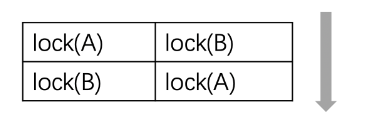

## 简介

承接上一个 [并发编程系列第一篇的内容](并发编程1--并发任务) 遇到的数据安全性的问题，这一篇的内容将会去介绍如何解决这个问题，篇幅比较长，请耐心阅读，绝对有收获🙂。

## mutex

开发并发系统的目的主要是为了提升性能：<u>将任务分散到多个线程，然后在不同的处理器上同时执行</u>。这些分散开来的线程通常会包含两类任务：

> 1. **独立**的对于划分给自己的数据的处理
> 2. 对于处理结果的**汇总**

> 其中<u>**第1项**任务因为**每个线程是独立的**，不存在竞争条件的问题</u>。
>
> 而<u>**第2项**任务，由于**所有线程都可能往总结果**（例如上面的`sum`变量）**汇总**，这就需要做保护了</u>。

在某一个具体的时刻，只应当有一个线程更新总结果，即：<u>保证每个线程对于共享数据的访问是"互斥"的</u>。`mutex` 就提供了这样的功能。

 `mutex`是**mut**ual **ex**clusion（互斥）的简写。 

- 主要API

| API                   | C++标准 | 说明                                             |
| :-------------------- | :------ | :----------------------------------------------- |
| mutex                 | C++11   | 提供基本互斥设施                                 |
| timed_mutex           | C++11   | 提供互斥设施，带有超时功能                       |
| recursive_mutex       | C++11   | 提供能被同一线程递归锁定的互斥设施               |
| recursive_timed_mutex | C++11   | 提供能被同一线程递归锁定的互斥设施，带有超时功能 |
| shared_timed_mutex    | C++14   | 提供共享互斥设施并带有超时功能                   |
| shared_mutex          | C++17   | 提供共享互斥设施                                 |

很明显，在这些类中，`mutex`是最基础的API。其他类都是在它的基础上的改进。所以这些类都提供了下面三个方法，并且它们的功能是一样的：

| 方法         | 说明                                 |
| ------------ | ------------------------------------ |
| **lock**     | 锁定互斥体，如果不可用，则阻塞       |
| **try_lock** | 尝试锁定互斥体，如果不可用，直接返回 |
| **unlock**   | 解锁互斥体                           |

> 1. 构造函数，**std::mutex不允许拷贝构造，也不允许 move 拷贝**，最初产生的 mutex 对象是处于 unlocked 状态的。
>
> 2. **lock()**，调用线程将锁住该互斥量。线程调用该函数会发生下面 3 种情况：
>
> (1). 如果该互斥量<u>当前**没有被锁住**，则调用线程将该互斥量锁住</u>，<u>直到调用 **unlock之前**，该线程一直拥有该锁</u>。
>
> (2). 如果当前互斥量<u>**被其他线程锁住**，则当前的调用线程被**阻塞**住</u>。
>
> (3). 如果当前互斥量<u>被当前调用线程锁住，则会产生死锁(deadlock)</u>。
>
> 3. **unlock()**， 解锁，释放对互斥量的所有权。
>
> 4. **try_lock()**，尝试锁住互斥量，如果互斥量被其他线程占有，则当前线程也不会被阻塞。线程调用该 函数也会出现下面 3 种情况:
>
> (1). 如果当前互斥量<u>没有被其他线程占有，则该线程锁住互斥量</u>，直到该线程调用 unlock 释放互斥量。
>
> (2). 如果当前互斥量<u>**被其他线程锁住**，则当前调用线程**返回 false**</u>，而<u>**并不会被阻塞掉**</u>。
>
> (3). 如果当前互斥量被当前调用线程锁住，则会产生死锁(deadlock)。

这三个方法提供了基础的锁定和解除锁定的功能。使用`lock`意味着你有很强的意愿一定要获取到互斥体，而使用`try_lock`则是进行一次尝试。这意味着如果失败了，你通常还有其他的路径可以走。

 在这些基础功能之上，其他的类分别在下面三个方面进行了扩展： 

> - **超时**：`timed_mutex`，`recursive_timed_mutex`，`shared_timed_mutex`的名称都<u>带有`timed`</u>，这意味着它们都支持超时功能。它们都提供了<u>`try_lock_for`和`try_lock_until`</u>方法，这两个方法分别可以<u>**指定超时的时间长度和时间点**</u>。如果<u>**在超时的时间范围内没有能获取到锁，则直接返回，不再继续等待**</u>。
> - **可重入**：`recursive_mutex`和`recursive_timed_mutex`的名称都<u>带有`recursive`</u>。可重入或者叫做可递归，<u>是指在**同一个线程中**，同一把锁**可以锁定多次**</u>。这就<u>避免了一些不必要的死锁</u>。
> - **共享**：`shared_timed_mutex`和`shared_mutex`提供了共享功能。对于这类互斥体，实际上是提供了两把锁：<u>一把是共享锁，一把是互斥锁</u>。<u>一旦某个线程获取了**互斥锁**，任何其他线程都**无法再获取互斥锁和共享锁**</u>；但是<u>如果有某个线程获取到了**共享锁**，其他线程**无法再获取到互斥锁，但是还有获取到共享锁**</u>。这里互斥锁的使用和其他的互斥体接口和功能一样。而共享锁可以同时被多个线程同时获取到（<u>*使用共享锁的接口见下面的表格*</u>）。共享锁通常用在[读者写者模型](https://en.wikipedia.org/wiki/Readers–writers_problem)上。

使用共享锁的接口如下：

| 方法            | 说明                                   |
| --------------- | -------------------------------------- |
| lock_shared     | 获取互斥体的共享锁，如果无法获取则阻塞 |
| try_lock_shared | 尝试获取共享锁，如果不可用，直接返回   |
| unlock_shared   | 解锁共享锁                             |

 接下来，我们就借助刚学到的`mutex`来改造我们的并发系统，改造后的程序如下： 

```C++
static mutex exclusive;

void concurrent_worker(int min, int max) {
  for (int i = min; i <= max; i++) {
    exclusive.lock(); // 1.
    sum += sqrt(i);
    exclusive.unlock(); // 2.
  }
}
```

这里只有两个地方需要关注：

> 1. 在访问共享数据之前加锁
> 2. 访问完成之后解锁

 运行一下改进后的程序，其结果输出如下： 

```
hardware_concurrency: 16
Concurrent task finish, 109135 ms consumed, Result: 2.10819e+13
```

 这下结果是对了，但是我们却发现这个版本比原先单线程的版本性能还要差很多。这是为什么？ 

> 这是因为加锁和解锁是有代价的，这里计算最耗时的地方在锁里面，<u>每次只能有一个线程串行执行</u>，相比于单线程模型，它不但是串行的，还增加了锁的负担，因此就更慢了。

这就是为什么前面说多线程系统会增加系统的复杂度，而且并非多线程系统一定就有更好的性能。

不过，对于这里的问题是可以改进的。我们仔细思考一下：<u>*我们划分给每个线程的数据其实是独立的，对于数据的处理是耗时的，但其实这部分逻辑每个线程可以单独处理，没必要加锁*</u>。只有在最后汇总数据的时候进行一次锁保护就可以了。

 于是我们改造`concurrent_worker`，像下面这样： 

```c++
void concurrent_worker(int min, int max) {
    //临时变量存储单个线程的运算结果
    double tmp = 0;
    for (int i = min; i <= max; i++) {
        tmp += sqrt(i);	// 1.
    }
    
    //加锁, 保护共享数据资源
    exclusive.lock();	// 2.
    sum += tmp;
    exclusive.unlock();
}
```

这段代码的改变在于两处：

> 1. 通过一个**局部变量保存当前线程的处理结果**
> 2. 在**汇总总结过的时候进行锁保护**

 运行一下改进后的程序，其结果输出如下： 

```
hardware_concurrency: 16
Concurrent task finish, 700 ms consumed, Result: 2.10819e+13
```

 可以看到，性能一下就提升了好多倍。我们终于体验到多线程带来的好处了。 

我们用锁的 **粒度**（granularity）来描述锁的范围。**细粒度**（fine-grained）是指锁保护较小的范围，**粗粒度**（coarse-grained）是指锁保护较大的范围。出于性能的考虑，我们<u>***应该保证锁的粒度尽可能的细***</u>。并且，<u>***不应该在获取锁的范围内执行耗时的操作，例如执行IO***</u>。如果是耗时的运算，也应该尽可能的移到锁的外面。 

## 死锁

死锁是指：两个或以上的运算单元，<u>***每一方都在等待其他方释放资源，但是所有方都不愿意释放资源***</u>。结果是没有任何一方能继续推进下去，于是整个系统无法再继续运转。 

下面我们来看一个编程示例。

```C++
#include <string>
#include <mutex>

using namespace std;

//账户类
class Account {
public:
    Account(string name, double money) : mName(name), mMoney(money) {};

public:
    //改变金额
    void changeMoney(double amount) {
        mMoney += amount;
    }
    
    string getName() {
        return mName;
    }
    double getMoney() {
        return mMoney;
    }
    
    //获取互斥量
    mutex* getLock() {
        return &mMoneyLock;
    }

private:
    string mName;
    double mMoney;
    mutex mMoneyLock;	//每个互斥量存在于对象中, 而非类共享
};
```

现在假设我们在开发一个银行的系统，这个系统包含了**转账**的功能。

首先我们创建一个`Account`类来描述银行账号。由于这仅仅是一个演示使用的代码，所以我们希望代码足够的简单。`Account`类仅仅包含名称和金额两个字段。

另外，为了支持并发，这<u>个类包含了一个`mutex`对象，用来保护账号金额</u>，在读写账号金额时需要先加锁保护。<u>**注意：**这个互斥量是在每个 `Account` 对象中，而非类共享</u>。

 接下来，我们再创建一个描述银行的`Bank`类。 

```C++
class Bank {
public:
    void addAccount(Account* account) {
        mAccounts.insert(account);
    }

    bool transferMoney(Account* accountA, Account* accountB, double amount) {
        //模拟银行转账
        
        //需要获取两个账号对象的锁
        lock_guard<mutex> guardA(*accountA->getLock()); // 1.
        
        //添加等待语句, 可直接死锁
        this_thread::sleep_for(chrono::seconds(1));
        
        lock_guard<mutex> guardB(*accountB->getLock());

        if (amount > accountA->getMoney()) { // 2.
            return false;
        }

        accountA->changeMoney(-amount); // 3.
        accountB->changeMoney(amount);
        return true;
    }

    double totalMoney() const {
        double sum = 0;
        for (auto a : mAccounts) {
            sum += a->getMoney();
        }
        return sum;
    }

private:
    set<Account*> mAccounts;
};
```

银行类中记录了所有的账号，并且提供了一个方法用来查询整个银行的总金额。

这其中，我们最主要要关注转账的实现：`transferMoney`。该方法的几个关键点如下：

> 1. 为了保证线程安全，**在修改每个账号之前，需要获取相应的锁**。
> 2. 判断转出账户金额是否足够，如果不够此次转账失败。
> 3. 进行转账。

 有了银行和账户结构之后就可以开发转账系统了，同样的，由于是为了演示所用，我们的转账系统也会尽可能的简单： 

```C++
//随机转账
void randomTransfer(Bank* bank, Account* accountA, Account* accountB) {
    while (true) {
        double randomMoney = ((double)rand() / RAND_MAX) * 100;
        if (bank->transferMoney(accountA, accountB, randomMoney)) {
            cout << "Transfer " << randomMoney << " from " << accountA->getName()
                << " to " << accountB->getName()
                << ", Bank totalMoney: " << bank->totalMoney() << endl;
        }
        else {
            cout << "Transfer failed, "
                << accountA->getName() << " has only $" << accountA->getMoney() << ", but "
                << randomMoney << " required" << endl;
        }
    }
}
```

这里每次生成一个随机数，然后通过银行进行转账。

最后我们在`main`函数中创建两个线程，互相在两个账号之间来回转账：

```C++
int main() {
    Account a("Paul", 100);
    Account b("Moira", 100);

    Bank aBank;
    aBank.addAccount(&a);
    aBank.addAccount(&b);
	
    //两个账户互相转账
    //会出现: 两个线程分别占用两个账户的锁, 请求另一个账户的锁时出现死锁
    thread t1(randomTransfer, &aBank, &a, &b);
    thread t2(randomTransfer, &aBank, &b, &a);

    t1.join();
    t2.join();

    return 0;
}

```

```
Transfer failed, Paul has only $1.77618, but 64.687 required
Transfer failed, Paul has only $1.77618, but 22.7729 required
Transfer failed, Paul has only $1.77618, but 81.2799 required
Transfer failed, Paul has only $1.77618, but 37.1044 required
Transfer failed, Paul has only $1.77618, but 36.6894 required
Transfer failed, Paul has only $1.77618, but 3.49742 required
Transfer failed, Paul has only $1.77618, but  to Paul, Bank totalMoney: 200
Transfer 27.3598 from Moira56.1296 required
Transfer failed, Paul has only $29.136, but 39.787 required
Transfer 11.9785 from Paul to Moira, Bank totalMoney: 200
Transfer failed, Paul has only $17.1575, but 32.4931 required
...

```

如果你运行了这个程序，你会发现很快它就卡住不动了。为什么？

> <u>*其实这边我一直没有出现死锁的问题😓，不知道为什么？*</u>

> 好吧，知道为什么了，如果没出现死锁，可以在**两个加锁语句中间添加一句等待**：
>
> `this_thread::sleep_for(chrono::seconds(1));`
>
> 这样第一次就死锁了。

因为发生了死锁。

我们仔细思考一下这两个线程的逻辑：<u>这两个线程可能会**同时获取其中一个账号的锁**，然后**又想获取另外一个账号的锁**，此时就发生了死锁</u>。如下图所示：



当然，发生死锁的原因远不止上面这一种情况。如果<u>两个线程**互相`join`**</u>就可能发生死锁。还有在一个线程中对一个<u>不可重入的互斥体</u>（例如`mutex`而非`recursive_mutex`）<u>**多次加锁**</u>也会死锁。 

如果仔细看一下上面的输出，我们会发现还有另外一个问题：<u>***这里的输出是乱的***</u>。两个线程的输出混杂在一起了。究其原因也很容易理解：两个线程可能会同时输出，没有做好隔离。

下面我们就来**逐步解决**上面的问题。

对于输出混乱的问题很好解决，专门用一把锁来保护输出逻辑即可：

```C++
//随机转账
mutex sCoutLock;	//输出互斥量
void randomTransfer(Bank* bank, Account* accountA, Account* accountB) {
    while (true) {
        double randomMoney = ((double)rand() / RAND_MAX) * 100;
        if (bank->transferMoney(accountA, accountB, randomMoney)) {
            sCoutLock.lock();
            cout << "Transfer " << randomMoney << " from " << accountA->getName()
                << " to " << accountB->getName()
                << ", Bank totalMoney: " << bank->totalMoney() << endl;
            sCoutLock.unlock();
        }
        else {
            sCoutLock.lock();
            cout << "Transfer failed, "
                << accountA->getName() << " has only $" << accountA->getMoney() << ", but "
                << randomMoney << " required" << endl;
            sCoutLock.unlock();
        }
    }
}
```

>  请思考一下两处`lock`和`unlock`调用，并考虑为什么不在`while(true)`下面写一次整体的加锁和解锁。 

这里博主提了个问题，至于问什么不在 `while(true)` 下面加锁呢？其实也很好理解，若在`while` 下加锁，那么两个线程在执行 `if (bank->transferMoney(accountA, accountB, randomMoney))` 这个语句时就会被锁住，<u>*这是两个线程实际上是在串行而不是并行，效率低而且没有必要。*</u>

## 通用锁定算法

- 主要API

| API      | C++标准 | 说明                                                 |
| :------- | :------ | :--------------------------------------------------- |
| lock     | C++11   | 锁定指定的互斥体，即锁定多个，若任何一个不可用则阻塞 |
| try_lock | C++11   | 试图通过重复调用 try_lock 获得互斥体的所有权         |

要避免死锁，需要仔细的思考和设计业务逻辑。

有一个比较简单的原则可以避免死锁，即：<u>***对所有的锁进行排序，每次一定要按照顺序来获取锁，不允许乱序***</u>。

这个原则虽然简单，但却不容易遵守。因为数据常常是分散在很多地方的。 

好消息是，C++ 11标准中为我们提供了一些工具来避免因为多把锁而导致的死锁。我们只要直接调用这些接口就可以了。这个就是上面提到的两个函数。它们都支持传入多个[Lockable](https://en.cppreference.com/w/cpp/named_req/Lockable)对象。 

接下来我们用它来改造之前死锁的转账系统： 

```C++
    bool transferMoney(Account* accountA, Account* accountB, double amount) {
        //模拟银行转账
		
        //获取两把锁
        lock(*accountA->getLock(), *accountB->getLock());    // 1.
        
        //需要获取两个账号对象的锁
        //因为已经提前进行 lock, 使用 adopt_lock 来告诉 lock_guard 已经被锁, 不要再二次加锁
        lock_guard<mutex> guardA(*accountA->getLock(), adopt_lock); // 2.
        
        this_thread::sleep_for(chrono::seconds(1));
        
        lock_guard<mutex> guardB(*accountB->getLock(), adopt_lock);	//3.

        if (amount > accountA->getMoney()) {
            return false;
        }

        accountA->changeMoney(-amount);
        accountB->changeMoney(amount);
        return true;
    }
```

这里只改动了3行代码。

> 1. 这里通过`lock`函数来**获取两把锁**，**若任何一个不可用则阻塞**。
>
> 2. `lock_guard` 在下面我们还会详细介绍。这里只要知道它会**在自身对象生命周期的范围内锁定互斥体即可**。
>
> 创建`lock_guard`的目的是为了在`transferMoney`**结束的时候释放锁**，`lockB`也是一样。
>
> 但需要注意的是，这里传递了 `adopt_lock`表示：<u>现在是已经获取到互斥体了的状态了，不用再次加锁（如果不加`adopt_lock`就是二次锁定了）</u>。

> 这里的  `adopt_lock` 可以理解为：<u>*就是将使用.lock 成员函数上锁的锁，绑定到 lock_guard 上，方便锁自动释放掉。*</u>

 现在这个转账程序会一直运行下去，不会再死锁了。输出也是正常的了。 

## 通用互斥管理

- 主要API

| API         | C++标准 | 说明                                       |
| :---------- | :------ | :----------------------------------------- |
| lock_guard  | C++11   | 实现严格**基于作用域**的互斥体所有权包装器 |
| unique_lock | C++11   | 实现**可移动**的互斥体所有权包装器         |
| shared_lock | C++14   | 实现**可移动的共享**互斥体所有权封装器     |
| scoped_lock | C++17   | 用于**多个互斥体的免死锁** RAII 封装器     |

| 锁定策略    | C++标准 | 说明                                                |
| :---------- | :------ | :-------------------------------------------------- |
| defer_lock  | C++11   | 类型为 `defer_lock_t`，不获得互斥的所有权           |
| try_to_lock | C++11   | 类型为`try_to_lock_t`，尝试获得互斥的所有权而不阻塞 |
| adopt_lock  | C++11   | 类型为`adopt_lock_t`，假设调用方已拥有互斥的所有权  |

互斥体（`mutex`相关类）提供了对于资源的保护功能。

> 但是手动的锁定（调用`lock`或者`try_lock`）和解锁（调用`unlock`）互斥体是要耗费比较大的精力的，我们需要精心考虑和设计代码才行。
>
> 因为我们需要保证，**在任何情况下，解锁要和加锁配对**，因为假设出现一条路径导致获取锁之后没有正常释放，就会影响整个系统。如果考虑方法还可以会抛出异常，这样的代码写起来会很费劲。 

鉴于这个原因，标准库就提供了上面的这些API。它们都使用了叫做 **RAII** 的编程技巧，来简化我们手动加锁和解锁的“体力活”。 

 请看下面的例子： 

```C++
// https://en.cppreference.com/w/cpp/thread/lock_guard

#include <thread>
#include <mutex>
#include <iostream>
 
int g_i = 0;
std::mutex g_i_mutex;  // 1.
 
void safe_increment()
{
  std::lock_guard<std::mutex> lock(g_i_mutex);  // 2.
  ++g_i;

  std::cout << std::this_thread::get_id() << ": " << g_i << '\n';
  // 3.
}
 
int main()
{
  std::cout << "main: " << g_i << '\n';
 
  std::thread t1(safe_increment); // 4.
  std::thread t2(safe_increment);
 
  t1.join();
  t2.join();
 
  std::cout << "main: " << g_i << '\n';
}
```

这段代码中：

> 1. 全局的互斥体`g_i_mutex`用来保护全局变量`g_i`
> 2. 这是一个设计为可以被多线程环境使用的方法。因此需要通过互斥体来进行保护。这里没有调用`lock`方法，而是**<u>直接使用`lock_guard`来锁定互斥体</u>**。
> 3. 在方法结束的时候，<u>局部变量`std::lock_guard lock`会被销毁</u>，它**对互斥体的锁定也就解除**了。
> 4. 在多个线程中使用这个方法。

### RAII

RAII全称是Resource Acquisition Is Initialization，直译过来就是：<u>**资源获取即初始化**</u>。

RAII是一种[C++编程技术](http://www.stroustrup.com/bs_faq2.html#finally)，它将必须在<u>使用前请求的资源（例如：分配的堆内存、执行线程、打开的套接字、打开的文件、锁定的互斥体、磁盘空间、数据库连接等——任何存在受限供给中的事物）的生命周期**与一个对象的生存周期相绑定**</u>。 

> RAII保证资源<u>可用于任何会访问该对象的函数</u>。
>
> 它亦<u>保证所有资源在其控制对象的生存期结束时，以获取顺序的逆序释放</u>。

类似地，若资源获取失败（构造函数以异常退出），则为已构造完成的对象和基类子对象所获取的所有资源，会以初始化顺序的逆序释放。这有效地利用了语言特性以消除内存泄漏并保证异常安全。

RAII 可总结如下:

> - 将**每个资源封装入一个类**，其中：
>   - <u>构造函数请求资源</u>，并建立所有类不变式，或在它无法完成时抛出异常，
>   - <u>析构函数释放资源</u>并决不抛出异常；
> - 始终经由 RAII 类的实例使用满足要求的资源，该资源
>   - 自身拥有自动存储期或临时生存期，或
>   - 具有与自动或临时对象的生存期绑定的生存期

回想一下上文中的`transferMoney`方法中的三行代码：

```c++
lock(*accountA->getLock(), *accountB->getLock());
lock_guard lockA(*accountA->getLock(), adopt_lock);
lock_guard lockB(*accountB->getLock(), adopt_lock);
```

如果使用`unique_lock`这三行代码还有一种等价的写法：

```c++
unique_lock lockA(*accountA->getLock(), defer_lock);
unique_lock lockB(*accountB->getLock(), defer_lock);
lock(*accountA->getLock(), *accountB->getLock());
```

请注意这里`lock`方法的调用位置。这里<u>先定义`unique_lock`**指定了`defer_lock`**</u>，因此实际没有锁定互斥体，而是到第三行才进行锁定。

最后，借助`scoped_lock`，我们可以将三行代码合成一行，这种写法也是等价的。

```C++
scoped_lock lockAll(*accountA->getLock(), *accountB->getLock());	//c++ 17
```

`scoped_lock`会在<u>**其生命周期范围内锁定互斥体，销毁的时候解锁**</u>。同时，它可以锁定多个互斥体，并且避免死锁。

> `scoped_lock` 和 `lock` 的区别在于： **<u>`lock` 不会主动释放</u>**，需要用 `lock_guard` 或者 `unique_lock` 辅助释放。

目前，只还有`shared_lock`我们没有提到。它与其他几个类的区别在于：它是以共享的方式锁定互斥体。

## 条件变量

| API                       | C++标准 | 说明                                         |
| :------------------------ | :------ | :------------------------------------------- |
| condition_variable        | C++ 11  | 提供与 std::unique_lock 关联的条件变量       |
| condition_variable_any    | C++ 11  | 提供与任何锁类型关联的条件变量               |
| notify_all_at_thread_exit | C++ 11  | 安排到在此线程完全结束时对 notify_all 的调用 |
| cv_status                 | C++ 11  | 列出条件变量上定时等待的可能结果             |

至此，我们还有一个地方可以改进。那就是：<u>转账金额不足的时候，程序直接返回了`false`</u>。这很难说是一个好的策略。因为，即便<u>虽然当前账号金额不足以转账，但只要别的账号又转账进来之后，当前这个转账操作也许就可以继续执行了</u>。

这在很多业务中是很常见的一个需求：<u>每一次操作都要正确执行，如果**条件不满足就停下来等待**，直到**条件满足之后再继续**</u>。而不是直接返回。

条件变量提供了一个可以<u>***让多个线程间同步协作***</u>的功能。这对于[生产者-消费者模型](https://en.wikipedia.org/wiki/Producer–consumer_problem)很有意义。在这个模型下：

> - **生产者** 和 **消费者** <u>共享一个工作区</u>。这个<u>区间的大小是有限的</u>。
> - **生产者 **总是<u>产生数据放入工作区</u>中，当<u>工作区满了，它就**停下来等消费者消费一部分数据**，然后继续工作</u>。
> - **消费者** 总是<u>从工作区中拿出数据使用</u>。当<u>工作区中的数据**全部被消费空了**之后，它也会**停下来等待生产者往工作区中放入新的数据**</u>。

从上面可以看到，无论是生产者还是消费者，当它们工作的条件不满足时，它们并不是直接报错返回，而是停下来等待，直到条件满足。

下面我们就借助于条件变量，再次改造之前的银行转账系统。

这个改造主要在于**账号类**。我们重点是要调整`changeMoney`方法。

```C++
#include <string>

#include <mutex>
#include <chrono>

#include <set>
#include <iostream>
using namespace std;

class Account {
public:
    Account(string name, double money) : mName(name), mMoney(money) {};

public:
    void changeMoney(double amount) {
        //unique_lock, 用于和条件变量进行配合使用
        unique_lock<mutex> lock(mMoneyLock); // 2.
        
        //传入一把锁, 当不满足条件时, 当前线程进行等待(阻塞), 并且释放锁
        mConditionVar.wait(lock, [this, amount] { // 3.
            return mMoney + amount > 0; // 4.
        });
        mMoney += amount;
        
        //重新唤醒正在 等待 (wait) 的线程, 唤醒时会尝试获取锁
        mConditionVar.notify_all(); // 5.
    }

    string getName() {
        return mName;
    }

    double getMoney() {
        return mMoney;
    }

private:
    string mName;
    double mMoney;
    mutex mMoneyLock;
    
    //添加条件变量, 可以让多个占有该 account 对象的锁的线程进行协作
    condition_variable mConditionVar; // 1.
};
```

这几处改动说明如下：

> 1. 这里声明了一个条件变量，用来在多个线程之间协作。
>
> 2. 这里使用的是`unique_lock`，这是为了与条件变量相配合。因为<u>**条件变量会解锁和重新锁定互斥体**</u>。
>
> 3. 这里是比较重要的一个地方：**通过条件变量进行等待**。
>
>    ​	此时：会<u>通过后面的 lambda 表达式判断条件是否满足</u>。
>
>    ​	如果满足则继续。
>
>    ​	如果不满足，则 **此处会解锁互斥体，并让当前线程等待**。**解锁**这一点非常重要，因为只有这样，才能让其他线程获取互斥体。
>
> 4. 这里是条件变量等待的条件。如果你不熟悉lambda表达式，请自行网上学习，或者阅读[我之前写的文章](https://paul.pub/cpp-lambda-function-bind/)。
>
> 5. 此处也很重要。当金额发生变动之后，我们需要<u>通知所有**在条件变量上等待的其他线程**</u>。
>
>    ​	此时所有<u>调用`wait`线程都会**再次唤醒**</u>，然后<u>尝试获取锁</u>（当然，只有一个能获取到）并<u>再次判断条件是否满足</u>。
>
>    ​	除了`notify_all`还有`notify_one`，它只通知一个等待的线程。**<u>`wait`和`notify`就构成了线程间互相协作的工具。</u>**

**请注意：`wait`和`notify_all`虽然是写在一个函数中的，但是在运行时它们是在多线程环境中执行的，因此对于这段代码，需要能够从不同线程的角度去思考代码的逻辑。这也是开发并发系统比较难的地方。** 

