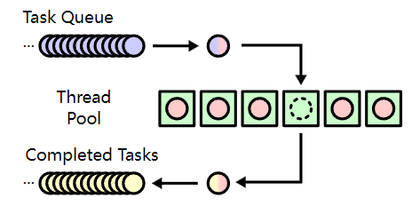

## 简介

 这一小节中，我们来熟悉更多的可以在并发环境中使用的工具，它们都位于 `<future>` 头文件中。 

| API           | C++标准 | 说明                                              |
| :------------ | :------ | :------------------------------------------------ |
| async         | C++11   | 异步运行一个函数，并返回保有其结果的`std::future` |
| future        | C++11   | 等待被异步设置的值                                |
| packaged_task | C++11   | 打包一个函数，存储其返回值以进行异步获取          |
| promise       | C++11   | 存储一个值以进行异步获取                          |
| shared_future | C++11   | 等待被异步设置的值（可能为其他 future 所引用）    |

## async

很多语言都提供了异步的机制。异步使得耗时的操作不影响当前主线程的执行流。

在C++11中，`async`便是完成这样的功能的。下面是一个代码示例：

```C++
static const int MAX = 10e8;
static double sum = 0;

void worker(int min, int max) {
    for (int i = min; i <= max; i++) {
        sum += sqrt(i);
    }
}

int main() {
    sum = 0;
    
    //异步 async 方式启动任务
    auto f1 = async(worker, 0, MAX);	// 1.
    cout << "Async task triggered" << endl;
    f1.wait();	// 2.
    cout << "Async task finish, result: " << sum << endl << endl;

    return 0;
}
```

这仍然是我们之前熟悉的例子。这里有两个地方需要说明：

> 1. 这里以**异步的方式启动了任务**。它会**返回一个`future`对象**。**`future`用来存储异步任务的执行结果**，关于`future`我们在后面`packaged_task`的例子中再详细说明。在这个例子中我们仅仅用它来等待任务执行完成。
> 2. 此处是等待异步任务执行完成。

需要注意的是，默认情况下，<u>`async`是启动一个新的线程；还是以同步的方式（不启动新的线程）运行任务，这一点标准是没有指定的，由具体的编译器决定</u>。

### launch::async

 如果希望一定要以新的线程来异步执行任务，可以通过`launch::async`来明确说明。`launch`中有两个常量：

> - `async`：运行新线程，以异步执行任务。
> - `deferred`：调用方线程上第一次请求其结果时才执行任务，即惰性求值。

除了通过函数来指定异步任务，还可以lambda表达式的方式来指定。如下所示：

```c++
// 12_async_task.cpp

int main() {
  	double result = 0;
  	cout << "Async task with lambda triggered, thread: " << this_thread::get_id() << endl;
    
    //传入参数 launch::async, 表示新开一个线程来执行异步任务
  	auto f2 = async(launch::async, [&result]() {
    	cout << "Lambda task in thread: " << this_thread::get_id() << endl;
    	for (int i = 0; i <= MAX; i++) {
      		result += sqrt(i);
    	}
  	});
  	f2.wait();
  	cout << "Async task with lambda finish, result: " << result << endl << endl;
  
  	return 0;
}
```

在上面这段代码中，我们使用一个lambda表达式来编写异步任务的逻辑，并通过`launch::async`明确指定要通过独立的线程来执行任务，同时我们打印出了线程的id。 

 这段代码输出如下： 

```
Async task with lambda triggered, thread: 50008
Lambda task in thread: 45540
Async task with lambda finish, result: 2.10819e+13
```

### 面向对象使用 async

对于面向对象编程来说，很多时候肯定希望以对象的方法来指定异步任务。下面是一个示例： 

```C++
//任务类型
class Worker {
public:
    Worker(int min, int max) : mMin(min), mMax(max) {} // 1.
    double work(int num) { // 2.
        mResult = 0;
        for (int i = mMin; i <= mMax; i++) {
            mResult += sqrt(i);
        }
        return mResult;
    }
    double getResult() {
        return mResult;
    }

private:
    int mMin;
    int mMax;
    double mResult;
};

int main() {
    Worker w(0, MAX);
    cout << "Task in class triggered" << endl;
    
    //将对象、以及指定的 类函数 传入 async
    auto f3 = async(&Worker::work, &w, 1); // 3.
    f3.wait();
    cout << "Task in class finish, result: " << w.getResult() << endl << endl;

    return 0;
}
```

这段代码有三处需要说明：

> 1. 这里通过一个类来描述任务。这个类是对前面提到的任务的封装。它包含了任务的输入参数，和输出结果。
>
> 2. `work`函数是任务的主体逻辑，并且<u>**需要传入一个 int 类型的参数**</u>。
>
> 3. 通过`async`执行任务：这里指定了具体的任务函数以及相应的对象。**请注意这里是`&w`，因此传递的是对象的指针**。如果不写`&`将传入`w`对象的临时复制。
>
>    ​	关于传入对象的指针，可以参考 <u>C++面向对象高级开发.Part1.5.操作符重载与临时对象</u>，这里介绍了在类成员函数中，编译器会<u>**隐式的将成员函数第一个参数传入 this 指针**</u>。
>
>    ​	这里笔者认为，`async` 其实跟这种设计十分相像；虽然说可以解释为使用 `obj->Type::MemberFunction` 也可以调用对象对应的成员函数。但 `async` 的重载只有两种：第一种的第一个参数为 `launch::async`；第二种为传入函数地址、参数。所以其实更像上述传入隐式的 this 指针的设计。

## packaged_task

在一些业务中，我们可能会<u>有很多的任务需要调度</u>。这时我们常常会设计出 **任务队列** 和 **线程池** 的结构。此时，就可以使用`packaged_task`来包装任务。 

> 类似于 [命令模式](https://blog.csdn.net/cutemypig/article/details/109675599)
>
> 该模式有<u>两个使用者</u>：**命令处理者（invoker）**、**命令接收者（receiver）**，以及一个**命令控制器（concrete command）**。
>
> 接收者 接收到命令之后，通过 控制器 去处理命令；在处理命令这个过程中，控制器 通过 处理者 去一步步处理得到对应结果。
>
> 可以参考上述命令模式的博客，**服务员--上菜--厨师** 的例子可以很好解释上述过程，作用是将 服务员 和 厨师分离。

`packaged_task`**绑定到一个函数或者可调用对象上**。当它<u>被调用时</u>，它就会<u>调用其绑定的函数或者可调用对象</u>。并且，可以通过与之相关联的`future`来获取任务的结果。调度程序只需要处理`packaged_task`，而非各个函数。

`packaged_task`对象是一个可调用对象，它可以被封装成一个`std::fucntion`，或者作为线程函数传递给`std::thread`，或者直接调用。

 下面是一个代码示例： 

```C++
#pragma once
#include <future>
#include <iostream>
using namespace std;

double concurrent_worker(int min, int max) {
    double sum = 0;
    for (int i = min; i <= max; i++) {
        sum += sqrt(i);
    }
    return sum;
}

double concurrent_task(int min, int max) {
    //收集 future 对象
    vector<future<double>> results; // 1.

    unsigned concurrent_count = thread::hardware_concurrency();
    min = 0;

    //根据硬件并发数创建线程
    for (int i = 0; i < concurrent_count; i++) { // 2.

        //绑定任务函数 concurrent_worker, 但无法获得返回值, 需要通过 future 来获取
        packaged_task<double(int, int)> task(concurrent_worker); // 3.

        //关联 future 对象
        results.push_back(task.get_future()); // 4.

        int range = max / concurrent_count * (i + 1);

        //创建线程执行任务, 并传入参数, 这位 detach 守护线程后台运行
        thread t(std::move(task), min, range); // 5.
        t.detach();

        min = range + 1;
    }

    cout << "threads create finish" << endl;
    double sum = 0;

    //通过 get 来阻塞获取结果
    for (auto& r : results) {
        sum += r.get(); // 6.
    }
    return sum;
}
```

在这段代码中：

> 1. 首先创建一个集合来存储`future`对象。我们将用它来获取任务的结果。
> 2. 同样的，根据CPU的情况来创建线程的数量。
> 3. 将任务包装成`packaged_task`。请注意，<u>由于`concurrent_worker`被包装成了任务，我们无法直接获取它的`return`值</u>。而是 **<u>要通过`future`对象来获取</u>**。
> 4. 获取任务关联的`future`对象，并将其存入集合中。
> 5. 通过一个新的线程来执行任务，并传入需要的参数。
> 6. 通过`future`集合，逐个获取每个任务的计算结果，将其累加。这里**`r.get()`获取到的就是每个任务中`concurrent_worker`的返回值**。

为了简单起见，这里的示例只使用了我们熟悉的例子和结构。

> 其实在这里已经发现 `packaged_task` 好用的地方了，在 [并发编程1--并发任务](并发编程1--并发任务) 和 [并发编程2--互斥量与锁](并发编程2--互斥量与锁) 中使用 `concurrent_worker` 的例子中，需要将计算结果**同步到全局变量**的 `sum` 中；
>
> 而在上述例子中，通过 `future.get()` 的方式可以很轻易的**获取任务的返回值**。

但在实际上的工程中，调用关系通常更复杂，你可以借助于`packaged_task`将任务组装成队列，然后通过[线程池](https://en.wikipedia.org/wiki/Thread_pool)的方式进行调度： 



## promise与future

在上面的例子中，**`concurrent_task`的结果是通过`return`返回的**。但在一些时候，我们可能不能这么做：<u>在得到任务结果之后，可能还有一些事情需要继续处理</u>，例如清理工作。

这个时候，就可以将`promise`与`future`配对使用。这样就可以将<u>**返回结果**和**任务结束**两个事情分开</u>。

下面是对上面代码示例的改写：

```C++
//不直接返回 sum, 而是通过一个 promise 对象存放结果
void concurrent_task(int min, int max, promise<double>* result) { // 1.
    vector<future<double>> results;

    unsigned concurrent_count = thread::hardware_concurrency();
    min = 0;
    for (int i = 0; i < concurrent_count; i++) {
        packaged_task<double(int, int)> task(concurrent_worker);
        results.push_back(task.get_future());

        int range = max / concurrent_count * (i + 1);
        thread t(std::move(task), min, range);
        t.detach();

        min = range + 1;
    }

    cout << "threads create finish" << endl;
    double sum = 0;
    for (auto& r : results) {
        sum += r.get();
    }
    
    //通过 promise.set_value 方法设置 promise 对象的值
    result->set_value(sum); // 2.
    cout << "concurrent_task finish" << endl;
}

int main() {
    auto start_time = chrono::steady_clock::now();

    promise<double> sum; // 3.
    concurrent_task(0, MAX, &sum);

    auto end_time = chrono::steady_clock::now();
    auto ms = chrono::duration_cast<chrono::milliseconds>(end_time - start_time).count();
    cout << "Concurrent task finish, " << ms << " ms consumed." << endl;
    
    //通过 promise.get_future().get() 获取结果。 同样的, 在没获得结果前阻塞当前线程
    cout << "Result: " << sum.get_future().get() << endl; // 4.
    return 0;
}
```

这段代码和上面的示例在很大程度上是一样的。只有小部分内容做了改动：

> 1. `concurrent_task`<u>不再直接返回计算结果</u>，而是**增加了一个`promise`对象来存放结果**。
> 2. 在任务计算完成之后，将总结过设置到`promise`对象上。一旦这里**调用了`set_value`，其相关联的`future`对象就会就绪。**
> 3. 这里是在`main`中创建一个`promoise`来存放结果，并以指针的形式传递进`concurrent_task`中。
> 4. 通过`sum.get_future().get()`来获取结果。第2点中已经说了：<u>一旦调用了`set_value`，其相关联的`future`对象就会就绪。</u>

需要注意的是，`future`对象只有被一个线程获取值。并且在调用`get()`之后，就没有可以获取的值了。如果从多个线程调用`get()`会出现数据竞争，其结果是未定义的。

如果真的需要在多个线程中获取`future`的结果，可以使用`shared_future`。

## 一些补充

关于 `future.get()` 方法， 这将阻塞主线程，直到future就绪。注意：`.get()`方法只能调用一次。 

> ***<u>调用 `get()` 方法之后，`future` 对象的状态将设置为 `empty`。</u>***

下面是一个代码示例： 

```c++
#include <future>
#include <thread>

#include <chrono>
using namespace std;

void thread_comute(std::promise<int>& promiseObj) {
    std::this_thread::sleep_for(std::chrono::seconds(1));
    promiseObj.set_value(100); // 3. set_value后，future变为就绪。
    cout << "thread_comute completed !" << endl;
}

int main() {
    /*
    * future && promise
    */
    auto start = std::chrono::steady_clock::now();
    
    promise<int> promiseObj;	// 1.
    future<int> futureObj = promiseObj.get_future();	// 2.

    thread t(&thread_comute, ref(promiseObj));
    cout << "thread create!" << endl;
    
    cout << futureObj.get() << endl;	// 4.
    auto end = std::chrono::steady_clock::now();
    cout << "futureObj.get() ! time: " << std::chrono::duration_cast<std::chrono::milliseconds>(end - start).count() << endl;
    
    std::this_thread::sleep_for(std::chrono::seconds(2));
    
    //此时创建的线程对象任务已经在主线程执行完成
    //调用 join, 标记线程 joinable 为 false, 可正常销毁
    t.join();
}    
```

在这段代码中：

> 1.创建 `promise` 对象，用于存放计算结果。
>
> 2.通过 `promise.get_future()` 方法来获得 `future` 对象，该对象用于获取异步的计算结果，**<u>此时 `funture` 对象的状态为 `pending`</u>**，即等待。
>
> 3.在线程处理函数 `thread_comute` 中，<u>`promise` 对象调用 `promise.set_value`，来设置自身的存储结果，**此时的 `future` 对象的状态为 `has_result`**。</u>
>
> 4.调用 `future.get` 方法，该方法在 `future` 对象的状态不为 `has_result` 时会阻塞当前线程。

程序的运行结果如下：

```
thread create!
thread_comute completed !
100
futureObj.get() ! time: 1013
```

此外，`std::future` **<u>不支持拷贝，支持移动构造</u>**。c++提供的另一个类`std::shared_future`支持拷贝。 

可以通过下面三个方式来获得`std::future`。

> - `std::promise`的 get_future 函数
> - `std::packaged_task`的 get_future 函数
> - `std::async` 函数 返回值

除了 `promise.set_value` 可以将 `future` 的状态设置为 `has_result` 外；**<u>`packaged_task` 和 `async` 执行结束后得到了返回结果</u>**，也可以让 `future`对象的状态设置为 `has_result`。

下面是一段示例代码：

```C++
    auto task = []() {
        std::this_thread::sleep_for(std::chrono::seconds(1));
        return 3;
    };

    //通过 async 获取future
    //return future
    auto f = async(task);
    auto startAsync = std::chrono::steady_clock::now();
    cout << "startAsync !" << endl;

    cout << f.get() << endl;    //等待 async 执行结束
    auto endAsync = std::chrono::steady_clock::now();
    cout << "endAsync ! time: " << std::chrono::duration_cast<std::chrono::milliseconds>(endAsync - startAsync).count() << endl;
```

运行结果如下：

```
startAsync !
3
endAsync ! time: 1009
```

